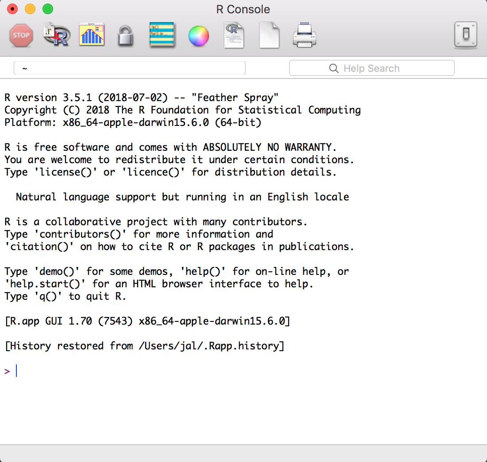

# Getting Started and Getting Help {#GettingStarted}

Introduction {-#intro-GettingStarted}
------------

This chapter sets the groundwork for the other chapters. It explains how
to download, install, and run R.

More importantly, it also explains how to get answers to your questions.
The R community provides a wealth of documentation and help. You are not
alone. Here are some common sources of help:
 
Local, installed documentation

:   When you install R on your computer, a mass of documentation is
    also installed. You can browse the local documentation 
    (Recipe \@ref(recipe-id265), "Viewing the Supplied Documentation") and search it
    (Recipe \@ref(recipe-id267), "Searching the Supplied Documentation"). We are amazed
    how often we search the web for an answer only to discover it was
    already available in the installed documentation.

[Task views](https://cran.r-project.org/web/views)

:   A task view describes packages that are specific to one area of
    statistical work, such as econometrics, medical imaging,
    psychometrics, or spatial statistics. Each task view is written and
    maintained by an expert in the field. There are more than 35 such task views,
    so there is likely to be one or more for your areas of interest. We
    recommend that every beginner find and read at least one task view
    in order to gain a sense of R’s possibilities
    (Recipe \@ref(recipe-id270), "Finding Relevant Functions and Packages").

Package documentation

:   Most packages include useful documentation. Many also include
    overviews and tutorials, called *vignettes* in the R community. The
    documentation is kept with the packages in package repositories,
    such as [CRAN]http://cran.r-project.org/), and it is automatically
    installed on your machine when you install a package.

Question and answer (Q&A) websites

:   On a Q&A site, anyone can post a question, and knowledgeable people
    can respond. Readers vote on the answers, so the best answers tend
    to emerge over time. All this information is tagged and archived
    for searching. These sites are a cross between a mailing list and a
    social network; [Stack Overflow](https://stackoverflow.com/)
    is the canonical example.

The web

:   The web is loaded with information about R, and there are R-specific
    tools for searching it
    (Recipe \@ref(recipe-id005), "Searching the Web for Help"). The web is a moving
    target, so be on the lookout for new, improved ways to organize and
    search information regarding R.

Mailing lists

:   Volunteers have generously donated many hours of time to answer
    beginners’ questions that are posted to the R mailing lists. The
    lists are archived, so you can search the archives for answers to
    your questions (Recipe \@ref(recipe-id268), "Searching the Mailing Lists").

Downloading and Installing R {#recipe-id001}
----------------------------

### Problem {-#problem-id001}

You want to install R on your computer.

### Solution {-#solution-id001}

Windows and macOS users can download R from CRAN, the Comprehensive R
Archive Network. Linux and Unix users can install R packages using their
package management tool:

#### Windows {-}

   1.  Open <https://www.r-project.org/> in your browser.
   1.  Click on “CRAN.” You’ll see a list of mirror sites, organized
        by country.
   1.  Select a site near you or the top one listed as "0-Cloud," which tends to work well for most locations (https://cloud.r-project.org/).
   1.  Click on “Download R for Windows” under “Download and Install R.”
   1.  Click on “base.”
   1.  Click on the link for downloading the latest version of R (an
        *.exe* file).
   1.  When the download completes, double-click on the *.exe* file and
        answer the usual questions.

#### macOS {-}

   1.  Open <https://www.r-project.org/> in your browser.
   1.  Click on “CRAN.” You’ll see a list of mirror sites, organized
        by country.
   1.  Select a site near you or the top one listed as "0-Cloud," which tends to work well for most locations.
   1.  Click on “Download R for (Mac) OS X.”
   1.  Click on the *.pkg* file for the latest version of R, under
        “Latest release:,” to download it.
   1.  When the download completes, double-click on the *.pkg* file and
        answer the usual questions.

#### Linux or Unix {-}

The major Linux distributions have packages for installing R. Table \@ref(tab:LinuxDistributions) shows some examples.

| Distribution        | Package name| 
| ------------------- | --------------| 
| Ubuntu or Debian    | r-base| 
| Red Hat or Fedora   | R.i386| 
| Suse                | R-base| 

Table: (\#tab:LinuxDistributions) Linux distributions 

Use the system’s package manager to download and install
the package. Normally, you will need the root password or `sudo`
privileges; otherwise, ask a system administrator to perform
the installation. 

### Discussion {-#discussion-id001}

Installing R on Windows or macOS is straightforward because there are
prebuilt binaries (compiled programs) for those platforms. You need only follow the
preceding instructions. The CRAN web pages also contain links to
installation-related resources, such as frequently asked questions
(FAQs) and tips for special situations (“Does R run under Windows Vista/7/8/Server 2008?”), that you may find useful.

The best way to install R on Linux or Unix is by using your Linux distribution package manager to install R as a package.
The distribution packages greatly streamline both the initial installation and subsequent updates.

On Ubuntu or Debian, use `apt-get` to download and install R. Run under
`sudo` to have the necessary privileges:

``` {-#I_programlisting1_d1e767 .r}
$ sudo apt-get install r-base
```

On Red Hat or Fedora, use `yum`:

``` {-#I_programlisting1_d1e784 .r}
$ sudo yum install R.i386
```

Most Linux platforms also have graphical package managers, which you might
find more convenient.

Beyond the base packages, we recommend installing the documentation
packages, too. We like to install
`r-base-html` (because we like browsing the hyperlinked documentation) as
well as `r-doc-html`, which installs the important R manuals locally:

``` {-#I_programlisting1_d1e815 .r}
$ sudo apt-get install r-base-html r-doc-html
```

Some Linux repositories also include prebuilt copies of R packages
available on CRAN. We don’t use them because we’d rather get software
directly from CRAN itself, which usually has the freshest versions.

In rare cases, you may need to build R from scratch. You might have an
obscure, unsupported version of Unix, or you might have special
considerations regarding performance or configuration. The build
procedure on Linux or Unix is quite standard. Download the tarball from
the home page of your CRAN mirror; it’s called something like *R-3.5.1.tar.gz*, except the “3.5.1” will be replaced by the latest
version. Unpack the tarball, look for a file called *INSTALL*, and
follow the directions.

### See Also {-#see_also-id001}

[*R in a Nutshell*](https://oreilly.com/catalog/9780596801717) (O’Reilly)
contains more details of downloading and installing R, including
instructions for building the Windows and macOS versions. Perhaps the
ultimate guide is the one entitled ["R Installation and
Administration"](https://cran.r-project.org/doc/manuals/R-admin.html),
available on CRAN, which describes building and installing R on a
variety of platforms.

This recipe is about installing the base package. See Recipe \@ref(recipe-id012),
[Installing Packages from CRAN](#recipe-id012), for installing add-on packages from CRAN.

Installing RStudio {#recipe-id002b}
----------

### Problem {-#problem-id002b}

You want a more comprehensive integrated development environment (IDE) than the R 
default. In other words, you want to install RStudio Desktop. 

### Solution {-#solution-id002b}

Over the past few years RStudio has become the most widely used IDE for R. We are of 
the opinion that most all R work should be done in the RStudio Desktop IDE unless
there is a compelling reason to do otherwise. RStudio makes multiple products including RStudio Desktop, 
RStudio Server, and RStudio Shiny Server, just to name a few. For this book we will use
the term *RStudio* to mean RStudio Desktop, though most concepts apply to RStudio Server as well. 

To install RStudio, download the latest installer for your platform from the [RStudio 
website]https://www.rstudio.com/products/rstudio/download/.

The RStudio Desktop Open Source License version is free to download and use. 

### Discussion {-}

This book was written and built using RStudio version 1.2.x and R versions 3.5.x. 
New versions of RStudio are 
released every few months, so be sure to update regularly. Note that RStudio works with whichever
version of R you have installed. So updating to the latest version of RStudio does *not* upgrade
your version of R. R must be upgraded separately. 

Interacting with R is slightly different in RStudio than in the built-in R user interface.
For this book, we've elected to use RStudio for all examples. 


Starting RStudio {#recipe-startingrstudio}
------------------------------------------------------

### Problem {#problem-startingrstudio}

You want to run RStudio on your computer. 

### Solution {#solution-startingrstudio}

A common mistake made by new users of R and RStudio is to accidentally start R when they intended to start RStudio. The easiest way to ensure you're actually starting RStudio is to search for RStudio on your desktop OS. Then use whatever method your OS provides for pinning the icon somewhere easy to find later. 

Windows

:   Click on the Start Screen menu in the lower-left corner of the screen. In the search box, type `**RStudio**`.

macOS

:   Look in your launchpad for the RStudio app or press Command-space and type `**Rstudio**` to search using Spotlight Search. 

Ubuntu

:   Press Alt-F1 and type `**RStudio**` to search for RStudio. 
    
### Discussion {#discussion-startingrstudio}

It's easy to get confused between R and RStudio because, as you can see in Figure \@ref(fig:icons), the icons look similar.

```{r icons, fig.cap='R and RStudio icons in macOS', echo=FALSE, eval=TRUE}
knitr::include_graphics("images_v2/ricons.png")
```

If you click on the R icon, you'll be greeted by something like Figure \@ref(fig:rconsole), which is the Base R interface on a Mac, but certainly not RStudio. 

```{r rconsole, fig.cap='The R console in macOS', echo=FALSE, eval=TRUE}

```

When you start RStudio, by default it will reopen the last project you were working on in RStudio. 

Entering Commands {#recipe-id007}
-----------------

### Problem {-#problem-id007}

You’ve started RStudio. Now what?

### Solution {-#solution-id007}

When you start RStudio, the main window on the left is an R session. From there you can enter
commands interactively directly to R.

### Discussion {-#discussion-id007}

R prompts you with `>`. To get started, just treat R like a big
calculator: enter an expression, and R will evaluate the expression and
print the result:

``` {r}
1 + 1
```

The computer adds 1 and 1, and displays the result, 2.

The `[1]` before the `2` might be confusing. To R, the result is a
vector, even though it has only one element. R labels the value with
`[1]` to signify that this is the first element of the vector... which is
not surprising, since it’s the *only* element of the vector.

R will prompt you for input until you type a complete expression. The
expression `max(1,3,5)` is a complete expression, so R stops reading
input and evaluates what it’s got:

``` {r}
max(1, 3, 5)
```

In contrast, `max(1,3,` is an incomplete expression, so R prompts you
for more input. The prompt changes from greater-than (`>`) to plus
(`+`), letting you know that R expects more:

``` {r}
max(
  1, 3,
  +5
)
```

It’s easy to mistype commands, and retyping them is tedious and
frustrating. So R includes command-line editing to make life easier. It
defines single keystrokes that let you easily recall, correct, and
reexecute your commands. Our typical command-line interaction goes
like this:

1.  I enter an R expression with a typo.

2.  R complains about my mistake.

3.  I press the up-arrow key to recall my mistaken line.

4.  I use the left and right arrow keys to move the cursor back to
    the error.

5.  I use the Delete key to delete the offending characters.

6.  I type the corrected characters, which inserts them into the
    command line.

7.  I press Enter to reexecute the corrected command.

That’s just the basics. R supports the usual keystrokes for recalling
and editing command lines, as listed in Table \@ref(tab:keystrokes).

|  Labeled key | Ctrl-key Combo | Effect
| ---- | ---- | ----
|  Up arrow | Ctrl-P | Recall previous command by moving backward through the history of commands.
|  Down arrow | Ctrl-N | Move forward through the history of commands.
|  Backspace | Ctrl-H | Delete the character to the left of the cursor.
|  Delete (Del) | Ctrl-D | Delete the character to the right of the cursor.
|  Home | Ctrl-A | Move the cursor to the start of the line.
|  End | Ctrl-E | Move the cursor to the end of the line.
|  Right arrow | Ctrl-F | Move the cursor right (forward) one character.
|  Left arrow | Ctrl-B | Move the cursor left (back) one character.
|     |   Ctrl-K | Delete everything from the cursor position to the end of the line.
|     |   Ctrl-U | Clear the whole darn line and start over.
|  Tab  | | Complete the name (on some platforms).

Table: (\#tab:keystrokes) R command shortcuts

On most operating systems, you can also use the mouse to highlight commands
and then use the usual copy and paste commands to paste text into a new
command line.

### See Also {-#see_also-id007}

See Recipe \@ref(recipe-id022), ["Typing Less and Accomplishing More"](#recipe-id022). From the Windows main menu, follow Help → Console for a complete list of keystrokes useful for command-line
editing.

Exiting from RStudio {#recipe-id097}
--------------

### Problem {-#problem-id097}

You want to exit from RStudio.

### Solution {-#solution-id097}

Windows and most Linux distributions

:   Select File → Quit Session from the main menu, or click on the X in the
    upper-right corner of the window frame.

macOS

:   Select File → Quit Session from the main menu; or press Command-q (⌘-q); or click on the red X in the upper-left
    corner of the window frame.

On all platforms, you can also use the `q` function (as in *q*uit) to
terminate R and RStudio:

``` {r, eval=FALSE}
q()
```

Note the empty parentheses, which are necessary to call the function.

### Discussion {-#discussion-id097}

Whenever you exit, R typically asks if you want to save your workspace. You have
three choices:

-   Save your workspace and exit.

-   Don’t save your workspace, but exit anyway.

-   Cancel, returning to the command prompt rather than exiting.

If you save your workspace, R writes it to a file called *.RData*
in the current working directory. Saving the workspace saves any R objects you have
created. The next time you start R in the same directory, the workspace will automatically load.
Saving your workspace will overwrite the previously
saved workspace, if any, so don’t save if you don’t like your changes (e.g., if you have accidentally erased critical data from your workspace). 

We recommend never saving your workspace when you exit, and instead always explicitly saving your project, scripts, and data. We also recommend that you turn off the prompt to save and autorestore the workspace in RStudio using the global options found in the menu Tools → Global Options and shown in Figure \@ref(fig:workspace). This way, when you exit R and RStudio, you won't be prompted to save your workspace. But keep in mind that any objects created but not saved to disk will be lost. 

```{r workspace, fig.cap='Save Workspace options', echo=FALSE, eval=TRUE}
knitr::include_graphics("images_v2/save_workspace.png")
```

### See Also {-#see_also-id097}

See Recipe \@ref(recipe-id008), ["Getting and Setting the Working Directory"](#recipe-id008), for more about the current working directory
and Recipe \@ref(recipe-id009), ["Saving Your Workspace"](#recipe-id009), for more about saving your workspace. Also see Chapter 2 of [*R in a Nutshell*](https://oreilly.com/catalog/9780596801717).

Interrupting R {#recipe-id100}
--------------

### Problem {-#problem-id100}

You want to interrupt a long-running computation and return to the
command prompt without exiting RStudio.

### Solution {-#solution-id100}

Press the Esc key on your keyboard, or click on the Session menu in RStudio and select Interrupt R. You may also click on the stop sign icon in the code console window. 

### Discussion {-#discussion-id100}

Interrupting R means telling R to stop running the current command but without deleting variables from memory or completely closing RStudio. That said, interrupting R can leave your variables in an indeterminate state, depending upon how far the computation had progressed, so check your workspace after interrupting.

### See Also {-#see_also-id100}

See Recipe \@ref(recipe-id097), ["Exiting from R"](#recipe-id097).

Viewing the Supplied Documentation {#recipe-id265}
----------------------------------

### Problem {-#problem-id265}

You want to read the documentation supplied with R.

### Solution {-#solution-id265}

Use the `help.start` function to see the documentation’s table of
contents:

``` {r, eval=FALSE}
help.start()
```

From there, links are available to all the installed documentation. In RStudio the help will
show up in the help pane, which by default is on the righthand side of the screen.

In RStudio you can also click help → R Help to get a listing with help options for both R and
RStudio. 

### Discussion {-#discussion-id265}

The base distribution of R includes a wealth of documentation—literally
thousands of pages. When you install additional packages, those packages
contain documentation that is also installed on your machine.

It is easy to browse this documentation via the `help.start` function,
which opens on the top-level table of contents. Figure \@ref(fig:helpstart) shows how `help.start` appears inside the help pane in RStudio. 

```{r helpstart, echo=FALSE, fig.cap='RStudio help.start'}
knitr::include_graphics("images_v2/help_start.png")
```

The two links in the Reference section are especially useful:

Packages

:   Click here to see a list of all the installed packages, both in the
    base packages and the additional, installed packages. Click on a
    package name to see a list of its functions and datasets.

Search Engine & Keywords

:   Click here to access a simple search engine, which allows you to
    search the documentation by keyword or phrase. There is also a list
    of common keywords, organized by topic; click one to see the
    associated pages.

The Base R documentation accessed via `help.start` is loaded on your computer
when you install R. The RStudio help, which you access by using the menu option 
help → R Help, presents a page with links to RStudio's website. So, you will need internet access to access the RStudio help links.

### See Also {-#see_also-id265}

The local documentation is copied from the [R Project
website](https://www.r-project.org), which may have updated documents.

Getting Help on a Function {#recipe-id003}
--------------------------

### Problem {-#problem-id003}

You want to know more about a function that is installed on your
machine.

### Solution {-#solution-id003}

Use `help` to display the documentation for the function:

``` {r, eval=FALSE}
help(functionname)
```

Use `args` for a quick reminder of the function arguments:

``` {r, eval=FALSE}
args(functionname)
```

Use `example` to see examples of using the function:

``` {r, eval=FALSE}
example(functionname)
```

### Discussion {-#discussion-id003}

We present many R functions in this book. Every R function has more bells
and whistles than we can possibly describe. If a function catches your
interest, we strongly suggest reading the help page for that function.
One of its bells or whistles might be very useful to you.

Suppose you want to know more about the `mean` function. Use the `help`
function like this:

``` {r, eval=FALSE}
help(mean)
```

This will open the help page for the `mean` function in the help pane in RStudio. A
shortcut for the `help` command is to simply type `**?**` followed by the
function name:

``` {r, eval=FALSE}
?mean
```

Sometimes you just want a quick reminder of the arguments to a function:
What are they, and in what order do they occur? For this case, use the `args` function:

``` {r}
args(mean)
```
```{r}
args(sd)
```

The first line of output from `args` is a synopsis of the function call.
For `mean`, the synopsis shows one argument, `x`, which is a vector of
numbers. For `sd`, the synopsis shows the same vector, `x`, and an
optional argument called `na.rm`. (You can ignore the second line of
output, which is often just `NULL`.) In RStudio you will see the `args` output as a 
floating tool tip over your cursor when you type a function name, as shown in Figure  \@ref(fig:tooltip). 

```{r tooltip, echo=FALSE, fig.cap='RStudio tooltip'}
knitr::include_graphics("images_v2/mean_tooltip.png")
```

Most documentation for functions includes example code near the end of the
document. A cool
feature of R is that you can request that it execute the examples,
giving you a little demonstration of the function’s capabilities. The
documentation for the `mean` function, for instance, contains examples,
but you don’t need to type them yourself. Just use the `example`
function to watch them run:

```{r}
example(mean)
```

The user typed `example(mean)`. Everything else was produced by R, which
executed the examples from the help page and displayed the results.

### See Also {-#see_also-id003}

See Recipe \@ref(recipe-id267): ["Searching the Supplied Documentation"](#recipe-id267), for searching
for functions and Recipe \@ref(recipe-id010): ["Displaying Loaded Packages via the Search Path"](#recipe-id010), for more about the search path.

Searching the Supplied Documentation {#recipe-id267}
------------------------------------

### Problem {-#problem-id267}

You want to know more about a function that is installed on your
machine, but the `help` function reports that it cannot find
documentation for any such function.

Alternatively, you want to search the installed documentation for a
keyword.

### Solution {-#solution-id267}

Use `help.search` to search the R documentation on your computer:

``` {r, eval=FALSE}
help.search("pattern")
```

A typical pattern is a function name or keyword. Notice that it must be
enclosed in quotation marks.

For your convenience, you can also invoke a search by using two question
marks (in which case the quotes are not required). Note that searching for a
function by name uses one question mark, while searching for a text pattern uses
two:

``` {-#I_programlisting1_d1e1896 .r}
> ??pattern
```

### Discussion {-#discussion-id267}

You may occasionally request help on a function only to be told R knows
nothing about it:

``` {r}
help(adf.test)
```

This can be frustrating if you *know* the function is installed on your
machine. Here the problem is that the function’s package is not
currently loaded, and you don’t know which package contains the
function. It’s a kind of catch-22 (the error message indicates the
package is not currently in your search path, so R cannot find the help
file; see Recipe \@ref(recipe-id010): ["Displaying Loaded Packages via the Search Path"](#recipe-id010), for more details).

The solution is to search all your installed packages for the function.
Just use the `help.search` function, as suggested in the error message:

``` {r, eval=FALSE}
help.search("adf.test")
```

The search will produce a listing of all packages that contain the
function:

``` {-#I_programlisting1_d1e1937 .r}
Help files with alias or concept or title matching 'adf.test' using
regular expression matching:

tseries::adf.test       Augmented Dickey-Fuller Test

Type '?PKG::FOO' to inspect entry 'PKG::FOO TITLE'.
```

The preceding output indicates that the `tseries` package
contains the `adf.test` function. You can see its documentation by
explicitly telling `help` which package contains the function:

``` {r, eval=FALSE}
help(adf.test, package = "tseries")
```
or you can use the double colon operator to tell R to look in a specific package:

``` {r, eval=FALSE}
?tseries::adf.test
```

You can broaden your search by using keywords. R will then find any
installed documentation that contains the keywords. Suppose you want to
find all functions that mention the Augmented Dickey–Fuller (ADF) test.
You could search on a likely pattern:

``` {r, eval=FALSE}
help.search("dickey-fuller")
```

### See Also {-#see_also-id267}

You can also access the local search engine through the documentation
browser; see Recipe \@ref(recipe-id265): ["Viewing the Supplied Documentation"](#recipe-id265), for how
this is done. See Recipe \@ref(recipe-id010): ["Displaying Loaded Packages via the Search Path"](#recipe-id010), for more about the search path
and Recipe \@ref(recipe-id2003): ["Getting Help on a Function"](#recipe-id003), for getting help on functions.

Getting Help on a Package {#recipe-id266}
-------------------------

### Problem {-#problem-id266}

You want to learn more about a package installed on your computer.

### Solution {-#solution-id266}

Use the `help` function and specify a package name (without a function
name):

``` {r, eval=FALSE}
help(package = "packagename")
```

### Discussion {-#discussion-id266}

Sometimes you want to know the contents of a package (the functions and
datasets). This is especially true after you download and install a new
package, for example. The `help` function can provide the contents plus
other information once you specify the package name.

This call to `help` would display the information for the `tseries`
package, a standard package in the base distribution (try it!):

``` {r}
help(package = "tseries")
```

The information begins with a description and continues with an index of
functions and datasets. In RStudio, the HTML-formatted help page will open in
the help window of the IDE.

Some packages also include vignettes, which are additional documents
such as introductions, tutorials, or reference cards. They are installed
on your computer as part of the package documentation when you install
the package. The help page for a package includes a list of its
vignettes near the bottom.

You can see a list of all vignettes on your computer by using the
`vignette` function:

``` {r, eval=FALSE}
vignette()
```

In RStudio this will open a new tab listing every package installed on your
computer that includes vignettes as well as the vignette names and descriptions.

You can see the vignettes for a particular package by including its
name:

``` {r, eval=FALSE}
vignette(package = "packagename")
```

Each vignette has a name, which you use to view the vignette:

``` {r, eval=FALSE}
vignette("vignettename")
```

### See Also {-#see_also-id266}

See Recipe \@ref(recipe-id003): ["Getting Help on a Function"](#recipe-id003), for getting help on a
particular function in a package.

Searching the Web for Help {#recipe-id005}
--------------------------

### Problem {-#problem-id005}

You want to search the web for information and answers regarding R.

### Solution {-#solution-id005}

Inside R, use the `RSiteSearch` function to search by keyword or phrase:

``` {r, eval=FALSE}
RSiteSearch("key phrase")
```

Inside your browser, try using these sites for searching:

[RSeek](https://rseek.org)

:   This is a Google custom search that is focused on
    R-specific websites.

[Stack Overflow](https://stackoverflow.com/)

:   Stack Overflow is a searchable Q&A site from Stack Exchange that is 
    oriented toward programming issues such as data structures, coding,
    and graphics. Stack Overflow is a great "first stop" for all your syntax questions. 

[Cross Validated](https://stats.stackexchange.com/)

:   Cross Validated is a Stack Exchange site focused on statistics, machine
    learning, and data analysis rather than programming. Cross Validated is a
    good place for questions about what statistical method to use. 

[RStudio Community](https://community.rstudio.com/)

:   The RStudio Community site is a discussion forum hosted by RStudio. The topics include R, RStudio, and associated technology. Being an RStudio site, this forum is often visited by RStudio staff and those who use the software frequently. This is a good place for general questions and questions that possibly don't fit as well into the Stack Overflow syntax-focused format. 

### Discussion {-#discussion-id005}

The `RSiteSearch` function will open a browser window and direct it to
the search engine on the [R Project website](https://search.r-project.org/).
There you will see an initial search that you can refine. For example, this
call would start a search for “canonical correlation”:

``` {r, eval=FALSE}
RSiteSearch("canonical correlation")
```

This is quite handy for doing quick web searches without leaving R.
However, the search scope is limited to R documentation and the
mailing list archives.

[RSeek](https://rseek.org) provides a wider search. Its virtue is that it
harnesses the power of the Google search engine while focusing on sites
relevant to R. That eliminates the extraneous results of a generic
Google search. The beauty of RSeek is that it organizes the
results in a useful way.

Figure \@ref(fig:rseek) shows the results of
visiting RSeek and searching for “correlation.” Note that the tabs across the top allow for drilling in to different types of content:

-   All results

-   Packages

-   Books

-   Support

-   Articles

-   For Beginners

```{r rseek, echo=FALSE, fig.cap='RSeek'}
knitr::include_graphics("images_v2/rseek_org.png")
```

[Stack Overflow]http://stackoverflow.com/) is a Q&A site,
which means that anyone can submit a question and experienced users will
supply answers—often there are multiple answers to each question.
Readers vote on the answers, so good answers tend to rise to the top.
This creates a rich database of Q&A dialogs, which you can search. Stack
Overflow is strongly problem oriented, and the topics lean toward the
programming side of R.

Stack Overflow hosts questions for many programming languages;
therefore, when entering a term into their search box, prefix it with
`[r]` to focus the search on questions tagged for R. For example,
searching via `[r] standard error` will select only the questions
tagged for R and will avoid the Python and C++ questions.

Stack Overflow also includes a [wiki about the R language](https://stackoverflow.com/tags/r/info) that is an excellent community-curated list of online R resources.

Stack Exchange (parent company of Stack Overflow) has a Q&A area
for statistical analysis called [Cross Validated](https://stats.stackexchange.com/). This area is more focused on
statistics than programming, so use this site when seeking answers that are 
more concerned with statistics in general and less with R in particular.

RStudio hosts their own [discussion board as well](https://community.rstudio.com/). This is a great place to ask general questions and more conceptual questions that may not work as well on Stack Overflow. 


### See Also {-#see_also-id005}

If your search reveals a useful package, use Recipe \@ref(recipe-id012), ["Installing Packages from CRAN"](#recipe-id012), to install it on your machine.

Finding Relevant Functions and Packages {#recipe-id270}
---------------------------------------

### Problem {-#problem-id270}

Of the 10,000+ packages for R, you have no idea which ones would be
useful to you.

### Solution {-#solution-id270}

-   Visit CRAN's [list of task views](https://cran.r-project.org/web/views/).
    Find and read the task
    view for your area, which will give you links to and descriptions of
    relevant packages. Or visit [RSeek](https://rseek.org), search by
    keyword,
    click on the Task Views tab, and select an applicable task view.

-   Visit [crantastic](http://crantastic.org/) and search for packages
    by keyword.

-   To find relevant functions, visit [RSeek](https://rseek.org), search by
    name or keyword, and click on the Functions tab.

-   To discover packages related to a certain field, explore
    [CRAN Task Views](https://cran.r-project.org/web/views/).  

### Discussion {-#discussion-id270}

This problem is especially vexing for beginners. You think R can solve
your problems, but you have no idea which packages and functions would
be useful. A common question on the mailing lists is: “Is there a
package to solve problem X?” That is the silent scream of someone
drowning in R.

As of this writing, there are more than 10,000 packages available for
free download from CRAN. Each package has a summary page with a short
description and links to the package documentation. Once you’ve located
a potentially interesting package, you would typically click on the
“Reference manual” link to view the PDF documentation with full details.
(The summary page also contains download links for installing the
package, but you’ll rarely install the package that way; see Recipe \@ref(recipe-id012),
["Installing Packages from CRAN"](#recipe-id012).)

Sometimes you simply have a generic interest—such as Bayesian analysis,
econometrics, optimization, or graphics. CRAN contains a set of task
view pages describing packages that may be useful. A task view is a
great place to start since you get an overview of what’s available. You
can see the list of task view pages at
[CRAN Task Views](https://cran.r-project.org/web/views/) or search for them as described
in the Solution. CRAN's Task Views lists a number of broad fields and shows packages that are used in each field. For example, there are task views for high performance
computing, genetics, time series, and social science, just to name a few.

Suppose you happen to know the name of a useful package—say, by seeing
it mentioned online. A complete, alphabetical list of packages is
available at [CRAN](https://cran.r-project.org/web/packages/) with links to
the package summary pages.

### See Also {-#see_also-id270}

You can download and install an R package called `sos` that provides
powerful other ways to search for packages; see the [vignette at SOS](https://cran.r-project.org/web/packages/sos/vignettes/sos.pdf).

Searching the Mailing Lists {#recipe-id268}
--------------------------- 

### Problem {-#problem-id268}

You have a question, and you want to search the archives of the mailing
lists to see whether your question was answered previously.

### Solution {-#solution-id268}

Open [Nabble](http://r.789695.n4.nabble.com/) in your browser. Search for a keyword or
    other search term from your question. This will show results from the support mailing lists.

### Discussion {-#discussion-id268}

This recipe is really just an application of Recipe \@ref(recipe-id005),
["Searching the Web for Help"](#recipe-id005). But it’s an important
application because you should search the mailing list archives before
submitting a new question to the list. Your question has probably been
answered before.

### See Also {-#see_also-id268}

CRAN has a list of additional resources for searching the web; see
[CRAN Search](https://cran.r-project.org/search.html).

Submitting Questions to Stack Overflow or Elsewhere in the Community {#recipe-id269}
-----------------------------------------

### Problem {-#problem-id269}

You have a question you can't find the answer to online, so you want to submit a question to the R community. 

### Solution {-#solution-id269}

The first step to asking a question online is to create a reproducible example. Having 
example code that someone can run and see your exact problem is the most critical part of asking for help online. A question with a good reproducible example has three components:

1. Example data - This can be simulated data or some real data that you provide

2. Example code - This code shows what you have tried or an error you are getting

3. Written description - This is where you explain what you have, what you'd like to have, and what you have tried that didn't work. 

The details of writing a reproducible example are covered in the Discussion. Once you have
a reproducible example, you can post your question on [Stack Overflow](https://stackoverflow.com/questions/ask). Be sure to include the `r` tag in the Tags section of the ask page.

If your question is more general or related to concepts instead of specific syntax, RStudio runs an RStudio Community [discussion forum](https://community.rstudio.com/). Note that the site is broken into multiple topics, so pick the topic category that best fits your question. 

Or you may submit your question to the R mailing lists (but don't submit to multiple sites, the mailing lists, and Stack Overflow, as that's considered rude cross-posting).

The [mailing lists page](https://www.r-project.org/mail.html) contains
general information and instructions for using the R-help mailing list.
Here is the general process:

1.  Subscribe to the R-help list at the [Main R Mailing
    List](https://stat.ethz.ch/mailman/listinfo/r-help).

2.  Write your question carefully and correctly and include your reproducible example.

3.  Mail your question to *r-help@r-project.org*.

### Discussion {-#discussion-id269}
The R mailing list, Stack Overflow, and the RStudio Community site are great resources, but please treat them as a last
resort. Read the help pages, read the documentation, search the help
list archives, and search the web. It is most likely that your question
has already been answered. Don’t kid yourself: very few questions are
unique. If you've exhausted all other options, maybe it's time to create a good question. 

The reproducible example is the crux of a good help request. The first component is example data. 
A good way to get this is to simulate the data using a few R functions. The following
example creates a data frame called `example_df` that has three columns, each of a different
data type:

```{r}
set.seed(42)
n <- 4
example_df <- data.frame(
  some_reals = rnorm(n),
  some_letters = sample(LETTERS, n, replace = TRUE),
  some_ints = sample(1:10, n, replace = TRUE)
)
example_df
```

Note that this example uses the command `set.seed` at the beginning. This ensures that
every time this code is run, the answers will be the same. The `n` value is the number of rows
of example data you would like to create. Make your example data as simple as possible to
illustrate your question. 

An alternative to creating simulated data is to use example data that comes with R. For example, the dataset `mtcars` contains a data frame with 32 records about different car
models:

```{r}
data(mtcars)
head(mtcars)
```

If your example is reproducible only with your own data, you can use `dput`
to put a bit of your own data in a string that you can use in your example. We'll 
illustrate that approach using two rows from the `mtcars` data:

```{r}
dput(head(mtcars, 2))
```
You can put the resulting `structure` directly in your question:

```{r}
example_df <- structure(list(mpg = c(21, 21), cyl = c(6, 6), disp = c(160, 
160), hp = c(110, 110), drat = c(3.9, 3.9), wt = c(2.62, 2.875
), qsec = c(16.46, 17.02), vs = c(0, 0), am = c(1, 1), gear = c(4, 
4), carb = c(4, 4)), row.names = c("Mazda RX4", "Mazda RX4 Wag"
), class = "data.frame")

example_df
```

The second part of a good reproducible example is the example minimal code. The code example
should be as simple as possible and illustrate what you are trying to do or have already
tried. It should *not* be a big block of code with many different things going on. Boil your example down to only the minimal amount of code needed. If you use any packages, be sure to include the `library` call at the beginning of your code. Also, don't include anything in your question that is potentially harmful to someone running your code, such as `rm(list=ls())`, which would delete all R objects in memory. Have empathy for the person trying to help you, and realize that they are volunteering their time to help you out and may run your code on the same machine they use to do their own work. 

To test your example, open a new R session and try running it. Once you've edited your code, it's time to give just a bit more information to your potential respondents. 
In plain text, describe what you were trying to do, what you've tried, and your question. Be as concise as possible. As with the example code, your objective is to communicate as efficiently as possible with the person reading your question. You may find it helpful to include in your description which version of R you are running as well as which platform (Windows, Mac, Linux). You can get that information easily with the `sessionInfo` command.

If you are going to submit your question to the R mailing lists, you should know there are actually several mailing lists. R-help is the main list for
general questions. There are also many special interest group (SIG)
mailing lists dedicated to particular domains such as genetics, finance,
R development, and even R jobs. You can see the full list at
[https://stat.ethz.ch/mailman/listinfo](https://stat.ethz.ch/mailman/listinfo).
If your question is specific
to a domain, you’ll get a better answer by selecting the
appropriate list. As with R-help, however, carefully search the SIG list
archives before submitting your question.  

### See Also {-#see_also-id269}

We suggest that you read Eric Raymond and Rick Moen's excellent essay entitled [“How to Ask Questions the Smart
Way”](http://www.catb.org/~esr/faqs/smart-questions.html) before submitting any question. Seriously. Read it.

Stack Overflow has an excellent post that includes details about creating a reproducible example. You can find that at [https://stackoverflow.com/q/5963269/37751](https://stackoverflow.com/q/5963269/37751).

Jenny Bryan has a great R package called `reprex` that helps in the creation of a good reproducible example and provides helper functions for writing the markdown text for sites like Stack Overflow. You can find that package on her [GitHub page](https://github.com/tidyverse/reprex).
