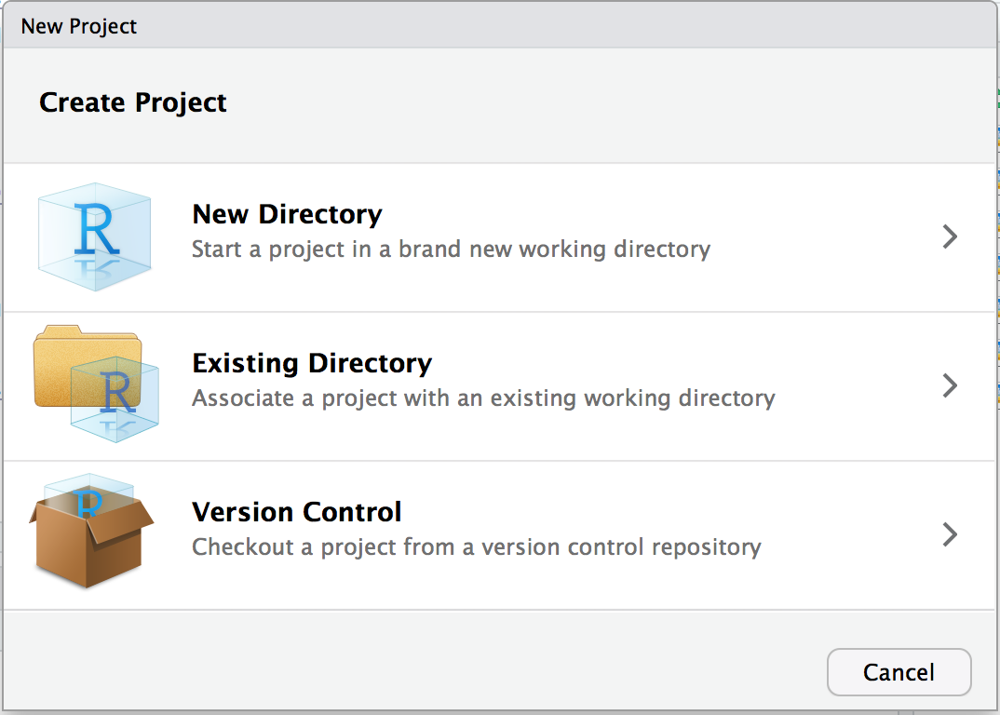
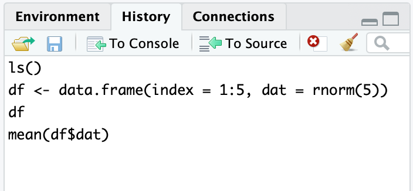

```{r include=FALSE, cache=FALSE}
set.seed(42)
options(digits = 3)

library(tidyverse)
library(knitr)

knitr::opts_chunk$set(
  comment = "#>",
  messages = FALSE, 
  collapse = TRUE,
  out.width = "85%",
  fig.align = 'center',
  fig.width = 6,
  fig.asp = 0.618,  # 1 / phi
  fig.show = "hold"
)

options(dplyr.print_min = 6, dplyr.print_max = 6)

# hook_output <- knit_hooks$get("output")
# knit_hooks$set(output = function(x, options) {
#   lines <- options$output.lines
#   if (is.null(lines)) {
#     return(hook_output(x, options))  # pass to default hook
#   }
#   x <- unlist(strsplit(x, "\n"))
#   more <- "etc ..."
#   if (length(lines)==1) {      # first n lines
#     if (length(x) > lines) {   # truncate the output, but add ....
#       x <- c(head(x, lines), more)
#     }
#   } else {
#     x <- c(more, x[lines], more)
#   }
#   # paste these lines together
#   x <- paste(c(x, ""), collapse = "\n")
#   hook_output(x, options)
# })

```

```{r, echo=FALSE}
library(knitr)
hook_output <- knit_hooks$get("output")
knit_hooks$set(output = function(x, options) {
  lines <- options$output.lines
  if (is.null(lines)) {
    return(hook_output(x, options))  # pass to default hook
  }
  x <- unlist(strsplit(x, "\n"))
  more <- "etc ..."
  if (length(lines)==1) {      # first n lines
    if (length(x) > lines) {   # truncate the output, but add ....
      x <- c(head(x, lines), more)
    }
  } else {
    x <- c(more, x[lines], more)
  }
  # paste these lines together
  x <- paste(c(x, ""), collapse = "\n")
  hook_output(x, options)
})
```

# Navigating the Software {#NavigatingTheSoftware}

## Introduction {-#intro-NavigatingTheSoftware}


Both R and RStudio are big chunks of software, first and foremost. You will inevitably
spend time doing what one does with any big piece of software:
configuring it, customizing it, updating it, and fitting it into your
computing environment. This chapter will help you perform those tasks.
There is nothing here about numerics, statistics, or graphics. This is
all about dealing with R and RStudio as software.

## Getting and Setting the Working Directory {#recipe-id008}


### Problem {-#problem-id008}

You want to change your working directory, or you just want to know what
it is.

### Solution {-#solution-id008}

RStudio

:   Navigate to a directory in the Files pane. Then from the Files pane, select More → Set As Working Directory, as shown in Figure \@ref(fig:workingdir).

```{r workingdir, fig.cap='RStudio: Set As Working Directory' , echo=FALSE, eval=TRUE}
knitr::include_graphics("images_v2/rstudio.files.png")
```

Console

:   Use `getwd` to report the working directory, and use `setwd` to
    change it:

``` {r, eval=TRUE}
getwd()
```
``` {r, eval=FALSE}
setwd("~/Documents/MyDirectory")
```

### Discussion {-#discussion-id008}

Your working directory is important because it is the default location
for all file input and output—including reading and writing data files,
opening and saving script files, and saving your workspace image. When
you open a file and do not specify an absolute path, R will assume that
the file is in your working directory.

If you're using RStudio projects, your default working directory will be the home directory of the project. See Recipe \@ref(recipe-CreateProject), ["Creating a New R Studio Project"](#recipe-CreateProject), for more about creating RStudio projects. 

### See Also {-#see_also-id008}

See Recipe \@ref(recipe-id033), ["Dealing with 'Cannot Open File' in Windows"](#recipe-id033), for dealing with filenames in Windows.

Creating a New RStudio Project {#recipe-CreateProject}
------------------

### Problem {-#problem-CreateProject}
You want to create a new RStudio project to keep all your files related to a specific project. 

### Solution {-#solution-CreateProject}
Click File → New Project as in Figure \@ref(fig:filenew-drop)

```{r filenew-drop, echo=FALSE, eval=TRUE, fig.cap="Selecting New Project"}
knitr::include_graphics("images_v2/rstudio.file.newproject.png")
```
This will open the New Project dialog box and allow you to choose which type of project you would like to create, as shown in Figure \@ref(fig:filenewmenu).

```{r filenewmenu, echo=FALSE, eval=TRUE, fig.cap="New Project dialog"}

```

### Discussion {-#discussion-CreateProject}
Projects are a powerful concept that's specific to RStudio. They help you by doing the following:

-  Setting your working directory to the project directory.
-  Preserving window state in RStudio so when you return to a project your windows are all as you left them. This includes opening any files you had open when you last saved your project. 
-  Preserving RStudio project settings.

To hold your project settings, RStudio creates a project file with an *.Rproj* extension in the project directory. If you open the project file in RStudio, it works like a shortcut for opening the project. In addition, RStudio creates a hidden directory named *.Rproj.user* to house temporary files related to your project. 

Any time you're working on something nontrivial in R we recommend creating an RStudio project. Projects help you stay organized and make your project workflow easier. 

Saving Your Workspace {#recipe-id009}
---------------------

### Problem {-#problem-id009}

You want to save your workspace and all variables and functions you have in memory.

### Solution {-#solution-id009}

Call the `save.image` function:

``` {r, eval=FALSE}
save.image()
```

### Discussion {-#discussion-id009}

Your workspace holds your R variables and functions, and it is created
when R starts. The workspace is held in your computer’s main memory and
lasts until you exit from R. You can easily view the contents of your workspace in RStudio in the Environment tab, as shown in Figure \@ref(fig:environment)

```{r environment, echo=FALSE, eval=TRUE, fig.cap="RStudio environment"}
knitr::include_graphics("images_v2/rstudio.environment.png")
```

However, you may want to save your workspace without exiting R, because you know bad things mysteriously happen when you close your laptop to carry it home. In this case, use the `save.image` function.

The workspace is written to a file called *.RData* in the working
directory. When R starts, it looks for that file and, if it finds it,
initializes the workspace from it.

Sadly, the workspace does not include your open graphs: for example, that
cool graph on your screen disappears when you exit R. The workspace also does not include the position of your windows or your RStudio settings. This is why we recommend using RStudio projects and writing your R scripts so that you can reproduce everything you've created.

### See Also {-#see_also-id009}

See Recipe \@ref(recipe-id008), ["Getting and Setting the Working Directory"](#recipe-id008), for setting the working directory.

Viewing Your Command History {#recipe-id023}
----------------------------

### Problem {-#problem-id023}

You want to see your recent sequence of commands.

### Solution {-#solution-id023}

Depending on what you are trying to accomplish, you can use a few different methods to access your prior command history. If you are in the RStudio console pane, you can press the up arrow to interactively scroll through past commands. 

If you want to see a listing of past commands, you can either execute the `history`
function or access the History pane in RStudio to view your most recent input:

``` {r, eval=FALSE}
history()
```

In RStudio typing `history()` into the console simply activates the History pane in RStudio (Figure \@ref(fig:history)). You could also make that pane visible by clicking on it with your cursor. 

```{r history, fig.cap='RStudio History pane', echo=FALSE, eval=TRUE}

```


### Discussion {-#discussion-id023}

The `history` function displays your most recent commands. In RStudio the `history` command will activate the History pane. If you were running R outside of RStudio, `history` shows the most recent 25 lines, but you can request more like so:

``` {r, eval=FALSE}
history(100)          # Show 100 most recent lines of history
history(Inf)          # Show entire saved history
```
From within RStudio, the History tab shows an exhaustive list of past commands in chronological order, with the most recent at the bottom of the list. You can highlight past commands with your cursor, then click on "To Console" or "To Source" to copy past commands into the console or source editor, respectively. This can be terribly handy when you've done interactive data analysis and then decide you want to save some past steps to a source file for later use. 

From the console you can see your history by simply pressing the up arrow to scroll backward through your input, which causes your previous typing to reappear, one line at a time.

If you’ve exited from R or RStudio, you can still see your command history. R
saves the history in a file called *.Rhistory* in the working directory. Open the file with a text editor and then scroll to the
bottom; you will see your most recent typing.

Saving the Result of the Previous Command {#recipe-id024}
-----------------------------------------

### Problem {-#problem-id024}

You typed an expression into R that calculated the value, but you forgot
to save the result in a variable.

### Solution {-#solution-id024}

A special variable called `.Last.value` saves the value of the most
recently evaluated expression. Save it to a variable before you type
anything else.

### Discussion {-#discussion-id024}

It is frustrating to type a long expression or call a long-running
function but then forget to save the result. Fortunately, you needn’t
retype the expression nor invoke the function again—the result was saved
in the `.Last.value` variable:

``` {r, eval=FALSE}
aVeryLongRunningFunction()  # Oops! Forgot to save the result!
x <- .Last.value            # Capture the result now
```

A word of caution here: the contents of `.Last.value` are overwritten every
time you type another expression, so capture the value immediately. If
you don’t remember until another expression has been evaluated, it’s too
late!

### See Also {-#see_also-id024}

See Recipe \@ref(recipe-id023), ["Viewing Your Command History"](#recipe-id023), to recall your command history.

Displaying Loaded Packages via the Search Path {#recipe-id010}
--------------------------

### Problem {-#problem-id010}

You want to see the list of packages currently loaded into R.

### Solution {-#solution-id010}

Use the `search` function with no arguments:

``` {r, eval=FALSE}
search()
```

### Discussion {-#discussion-id010}

The search path is a list of packages that are currently loaded into
memory and available for use. Although many packages may be installed on
your computer, only a few of them are actually loaded into the R
interpreter at any given moment. You might be wondering which packages
are loaded right now.

With no arguments, the `search` function returns the list of loaded
packages. It produces an output like this:

``` {r, eval=TRUE}
search()
```

Your machine may return a different result, depending on what’s
installed there. The return value of `search` is a vector of strings.
The first string is `".GlobalEnv"`, which refers to your workspace. Most
strings have the form `"package:*packagename*"`, which indicates that the
package called `*packagename*` is currently loaded into R. In the preceding example, you can see many tidyverse packages installed, including `purrr`, `ggplot2`, and `tibble`. 

R uses the search path to find functions. When you type a function name,
R searches the path—in the order shown—until it finds the function in a
loaded package. If the function is found, R executes it. Otherwise, it
prints an error message and stops. (There is actually a bit more to it:
the search path can contain environments, not just packages, and the
search algorithm is different when initiated by an object within a
package; see the *R Language Definition* for details.)

Since your workspace (`.GlobalEnv`) is first in the list, R looks for
functions in your workspace before searching any packages. If your
workspace and a package both contain a function with the same name, your
workspace will “mask” the function; this means that R stops searching
after it finds your function and so never sees the package function.
This is a blessing if you want to override the package function...and a
curse if you still want access to it. If you find yourself feeling cursed because you (or some package you loaded) overrode a function (or other object) from an existing loaded package, you can use the full `*environment*::*name*` form to call an object from a loaded package environment. For example, if you wanted to call the `dplyr` function `count`, you could do so using `dplyr::count`. Using the full explicit name to call a function will work even if you have not loaded the package. So if you have `dplyr` installed but not loaded, you can still call `dplyr::count`. It is becoming increasingly common with online examples to show the full `*packagename*::*function*` in examples. While this removes ambiguity about where a function comes from, it makes example code very wordy. 

Note that R will include only *loaded* packages in the search path. So if you have installed a package, but not loaded it by using `library(*packagename*)`, then R will not add that package to the search path.

R also uses the search path to find R datasets (not files) or any other object via a similar procedure.

Unix and Mac users: don’t confuse the R search path with the Unix search path
(the `PATH` environment variable). They are conceptually similar but two
distinct things. The R search path is internal to R and is used by R
only to locate functions and datasets, whereas the Unix search path is
used by the OS to locate executable programs.

### See Also {-#see_also-id010}

See Recipe \@ref(recipe-id013), ["Accessing the Functions in a Package"](#recipe-id013), for loading packages into R and Recipe \@ref(recipe-id094), ["Viewing the List of Installed Packages"](#recipe-id094), for the list of installed packages (not just loaded packages).

Viewing the List of Installed Packages {#recipe-id094}
--------------------------------------

### Problem {-#problem-id094}

You want to know what packages are installed on your machine.

### Solution {-#solution-id094}

Use the `library` function with no arguments for a basic list. Use
`installed.packages` to see more detailed information about the
packages.

### Discussion {-#discussion-id094}

The `library` function with no arguments prints a list of installed
packages. The list can be quite long. 

``` {r, eval=FALSE}
library()
```

In RStudio, the list is displayed in a new tab in the editor window. 

You can get more details via the `installed.packages` function, which
returns a matrix of information regarding the packages on your machine.
Each row corresponds to one installed package. The columns
contain information such as package name, library path, and version.
The information is taken from R’s internal database of installed
packages.

To extract useful information from this matrix, use normal indexing
methods. The following snippet calls `installed.packages` and extracts
both the `Package` and `Version` columns for the first five packages, letting you see what version of each package is installed:

``` {r}
installed.packages()[1:5, c("Package", "Version")]
```

### See Also {-#see_also-id094}

See Recipe \@ref(recipe-id013), ["Accessing the Functions in a Package"](#recipe-id013), for loading a package into memory.

Accessing the Functions in a Package {#recipe-id013}
------------------------------------

### Problem {-#problem-id013}

A package installed on your computer is either a standard package or a
package you've downloaded. When you try using functions in the package,
however, R cannot find them.

### Solution {-#solution-id013}

Use either the `library` function or the `require` function to load the
package into R:

``` {r, eval=FALSE}
library(packagename)
```

### Discussion {-#discussion-id013}

R comes with several standard packages, but not all of them are
automatically loaded when you start R. Likewise, you can download and
install many useful packages from CRAN or GitHub, but they are not automatically
loaded when you run R. The `MASS` package comes standard with R, for
example, but you could get this message when using the `lda` function in
that package:

``` {r, error=TRUE}
lda(x)
```

R is complaining that it cannot find the `lda` function among the
packages currently loaded into memory.

When you use the `library` function or the `require` function, R loads
the package into memory and its contents become immediately available to
you:

``` {r, error=TRUE}
my_model <- 
  lda(cty ~ displ + year, data = mpg)

library(MASS)                          # Load the MASS library into memory
my_model <-
  lda(cty ~ displ + year, data = mpg)  # Now R can find the function

```

Before you call `library`, R does not recognize the function name.
Afterward, the package contents are available and calling the `lda`
function works.

Notice that you needn’t enclose the package name in quotes.

The `require` function is nearly identical to `library`. It has two
features that are useful for writing scripts. It returns `TRUE` if the
package was successfully loaded and `FALSE` otherwise. It also generates
a mere warning if the load fails—unlike `library`, which generates an
error.

Both functions have a key feature: they do not reload packages that are
already loaded, so calling twice for the same package is harmless. This
is especially nice for writing scripts. The script can load needed
packages while knowing that loaded packages will not be reloaded.

The `detach` function will unload a package that is currently loaded:

``` {r}
detach(package:MASS)
```

Observe that the package name must be qualified, as in `package:MASS`.

One reason to unload a package is that it contains a function whose name
conflicts with a same-named function lower on the search list. When such
a conflict occurs, we say the higher function masks the lower function.
You no longer “see” the lower function because R stops searching when it
finds the higher function. Hence, unloading the higher package unmasks
the lower name.

### See Also {-#see_also-id013}

See Recipe \@ref(recipe-id010), ["Displaying Loaded Packages via the Search Path"](#recipe-id010).

Accessing Built-in Datasets {#recipe-id257}
---------------------------

### Problem {-#problem-id257}

You want to use one of R’s built-in datasets, or you want to access one of the datasets that comes with another package. 

### Solution {-#solution-id257}

The standard datasets distributed with R are already available to you,
since the `datasets` package is in your search path. If you've loaded any other packages, datasets that come with those loaded packages will also be available in your search path.

To access datasets in other packages, use the `data` function while
giving the dataset name and package name:

``` {r, eval=FALSE}
data(dsname, package = "pkgname")
```

### Discussion {-#discussion-id257}

R comes with many built-in datasets. Other packages, such as `dplyr` and `ggplot2`, also come with example data that's used in the examples found in their help files. These datasets are useful when you are learning about R, since they provide data with which to experiment. 

Many datasets are kept in a package called (naturally enough)
`datasets`, which is distributed with R. That package is in your search
path, so you have instant access to its contents. For example, you can
use the built-in dataset called `pressure`:

``` {r}
head(pressure)
```

If you want to know more about `pressure`, use the `help` function to
learn about it and other datasets:

``` {r, eval=FALSE}
help(pressure)      # Bring up help page for pressure dataset
```

You can see a table of contents for `datasets` by calling the `data`
function with no arguments:

``` {r, eval=FALSE}
data()              # Bring up a list of datasets
```

Any R package can elect to include datasets that supplement those
supplied in `datasets`. The `MASS` package, for example, includes many
interesting datasets. Use the `data` function to load a dataset from a
specific package by using the `package` argument. `MASS` includes a
dataset called `Cars93`, which you can load into memory in this way:

``` {r}
data(Cars93, package = "MASS")
```

After this call to `data`, the `Cars93` dataset is available to you;
then you can execute `summary(Cars93)`, `head(Cars93)`, and so forth.

When attaching a package to your search list (e.g., via
`library(MASS)`), you don’t need to call `data`. Its datasets become
available automatically when you attach it.

You can see a list of available datasets in `MASS`, or any other
package, by using the `data` function with a `package` argument and no
dataset name:

``` {r, eval=FALSE}
data(package = "pkgname")
```

### See Also {-#see_also-id257}

See Recipe \@ref(recipe-id010), ["Displaying Loaded Packages via the Search Path"](#recipe-id010), for more about the
search path and Recipe \@ref(recipe-id013), ["Accessing the Functions in a Package"](#recipe-id013),
for more about packages and the `library` function.


Installing Packages from CRAN {#recipe-id012}
-----------------------------

### Problem {-#problem-id012}

You found a package on CRAN, and now you want to install it on your
computer.

### Solution {-#solution-id012}

R code

:   Use the `install.packages` function, putting the name of the package
    in quotes:

``` {r, eval=FALSE}
install.packages("packagename")
```

RStudio

:   The Packages window in RStudio helps make installing new R packages straightforward. All packages that are installed on your machine are listed in the Packages window, along with description and version information. To load a new package from CRAN, click on the Install button near the top of the Packages window, as shown in Figure \@ref(fig:packageswindow).

```{r packageswindow, fig.cap='RStudio Packages window', echo=FALSE, eval=TRUE}
knitr::include_graphics("images_v2/rstudio.packages.png")
```

### Discussion {-#discussion-id012}

Installing a package locally is the first step toward using it. If you are installing packages outside of RStudio, the
installer may prompt you for a mirror site from which it can download
the package files. It will then display a list of CRAN mirror sites. The top CRAN mirror is 0-Cloud. This is typically the best option, as it connects you to a globally mirrored *content delivery network* (CDN) sponsored by RStudio. If you want to select a different mirror, choose one geographically close to you.

The official CRAN server is a relatively modest machine generously
hosted by the Department of Statistics and Mathematics at WU Wien,
Vienna, Austria. If every R user downloaded from the official server, it
would buckle under the load, so there are numerous mirror sites around
the globe. In RStudio the default CRAN server is set to be the RStudio CRAN mirror. The RStudio CRAN mirror is accessible to all R users, not just those running the RStudio IDE. 

If the new package depends upon other packages that are not already
installed locally, then the R installer will automatically download and
install those required packages. This is a huge benefit that frees you
from the tedious task of identifying and resolving those dependencies.

There is a special consideration when you are installing on Linux or Unix. You
can install the package either in the systemwide library or in your
personal library. Packages in the systemwide library are available to
everyone; packages in your personal library are (normally) used only by
you. So a popular, well-tested package would likely go in the
systemwide library, whereas an obscure or untested package would go into
your personal library.

By default, `install.packages` assumes you are performing a systemwide
install. If you do not have sufficient user permissions to install in the systemwide library location, R will ask if you would like to install the package in a user library. The default that R suggests is typically a good choice. However, if you would like to control the path for your library location, you can use the `lib=` argument of the `install.packages` function:

``` {r, eval=FALSE}
install.packages("packagename", lib = "~/lib/R")
```

Or you can change your default CRAN server as described in Recipe \@ref(recipe-id272), 
["Setting or Changing a Default CRAN Mirror"](#recipe-id272).

### See Also {-#see_also-id012}

See Recipe \@ref(recipe-id270), ["Finding Relevant Functions and Packages"](#recipe-id270), for ways to find relevant packages and Recipe \@ref(recipe-id013), 
["Accessing the Functions in a Package"](#recipe-id013), for using a
package after installing it.

See also Recipe \@ref(recipe-id272), ["Setting or Changing a Default CRAN Mirror"](#recipe-id272).

Installing a Package from GitHub {#recipe-installGH}
------------------

### Problem {-#problem-installGH}
You've found an interesting package you'd like to try. However, the author has not yet published the package on CRAN, but has published it on GitHub. You'd like to install the package directly from GitHub. 

### Solution {-#solution-installGH}
Ensure you have the `devtools` package installed and loaded:

```{r, eval=FALSE, echo=TRUE}
install.packages("devtools")
library(devtools)
```
Then use `install_github` and the name of the GitHub repository to install directly from GitHub. For example, to install Thomas Lin Pederson's `tidygraph` package, you would execute the following:

```{r, eval=FALSE}
install_github("thomasp85/tidygraph")
```

### Discussion {-#discussion-installGH}

The `devtools` package contains helper functions for installing R packages from remote repositories, like GitHub. If a package has been built as an R package and then hosted on GitHub, you can install the package using the `install_github` function by passing the GitHub username and repository name as a string parameter. You can determine the GitHub username and repo name from the GitHub URL, or from the top of the GitHub page, as in the example shown in Figure \@ref(fig:github-screen).

```{r github-screen, echo=FALSE, eval=TRUE, fig.cap='Example GitHub project page'}
knitr::include_graphics("images_v2/github.shot.png")
```

Setting or Changing a Default CRAN Mirror {#recipe-id272}
-----------------------------

### Problem {-#problem-id272}

You are downloading packages. You want to set or change your default CRAN mirror.

### Solution {-#solution-id272}

In RStudio, you can change your default CRAN mirror from the RStudio Preferences menu shown in Figure \@ref(fig:packagepref).

```{r packagepref, echo=FALSE, eval=TRUE, fig.cap='RStudio package preferences'}
knitr::include_graphics("./images_v2/rstudio.package.pref.png")
```

If you are running R without RStudio, you can change your CRAN mirror using the following solution. This solution assumes you have an *.Rprofile*, as described in Recipe \@ref(recipe-id099), ["Customizing R Startup"](#recipe-id099):

1.  Call the `chooseCRANmirror` function:

``` {r, eval=FALSE}
chooseCRANmirror()
```

R will present a list of CRAN mirrors.

2.  Select a CRAN mirror from the list and press OK.

3.  To get the URL of the mirror, look at the first element of the
    `repos` option:

``` {r, eval=FALSE}
options("repos")[[1]][1]
```

4.  Add this line to your *.Rprofile* file. If you want the RStudio CRAN mirror, you would do the following:

``` {r, eval=FALSE}
options(repos = c(CRAN = "http://cran.rstudio.com"))
```

Or you could use the URL of another CRAN mirror.

### Discussion {-#discussion-id272}

When you install packages, you probably use the same CRAN mirror each
time (namely, the mirror closest to you or the RStudio mirror) because RStudio does not prompt you every time you load a package; it simply uses the setting from the Preferences menu. You may want to change that mirror to use a different mirror that's closer to you or controlled by your employer. Use this solution to change your repo so that every time you start R or RStudio, you will be using your desired repo. 

The `repos` option is the name of your default mirror. The
`chooseCRANmirror` function has the important side effect of setting the
`repos` option according to your selection. The problem is that R
forgets the setting when it exits, leaving no permanent default. By
setting `repos` in your *.Rprofile*, you restore the setting every time
R starts.

### See Also {-#see_also-id272}

See Recipe \@ref(recipe-id099), ["Customizing R Startup"](#recipe-id099), for more about the *.Rprofile* file and the `options` function.

Running a Script {#recipe-id014}
----------------

### Problem {-#problem-id014}

You captured a series of R commands in a text file. Now you want to
execute them.

### Solution {-#solution-id014}

The `source` function instructs R to read the text file and execute its
contents:

``` {r, eval=FALSE}
source("myScript.R")
```

### Discussion {-#discussion-id014}

When you have a long or frequently used piece of R code, capture it
inside a text file. That lets you easily rerun the code without having
to retype it. Use the `source` function to read and execute the code,
just as if you had typed it into the R console.

Suppose the file *hello.R* contains this one, familiar greeting:

``` {r, eval=FALSE}
print("Hello, World!")
```

Then sourcing the file will execute the file contents:

``` {r}
source("hello.R")
```

Setting `echo=TRUE` will echo the script lines before they are executed,
with the R prompt shown before each line:

``` {r}
source("hello.R", echo = TRUE)
```

### See Also {-#see_also-id014}

See Recipe \@ref(recipe-id022), ["Typing Less and Accomplishing More"](#recipe-id022), for running blocks of R code inside the GUI.

Running a Batch Script {#recipe-id015}
----------------------

### Problem {-#problem-id015}

You are writing a command script, such as a shell script in Unix or macOS
or a BAT script in Windows. Inside your script, you want to execute an R
script.

### Solution {-#solution-id015}

Run the R program with the `CMD BATCH` subcommand, giving the script
name and the output file name:

``` {bash, eval=FALSE}
R CMD BATCH scriptfile outputfile
```

If you want the output sent to `stdout` or if you need to pass
command-line arguments to the script, consider the `Rscript` command
instead:

``` {bash, eval=FALSE}
Rscript scriptfile arg1 arg2 arg3
```

### Discussion {-#discussion-id015}

R is normally an interactive program, one that prompts the user for
input and then displays the results. Sometimes you want to run R in
batch mode, reading commands from a script. This is especially useful
inside shell scripts, such as scripts that include a statistical
analysis.

The `CMD BATCH` subcommand puts R into batch mode, reading from
`*scriptfile*` and writing to `*outputfile*`. It does not interact with a user.

You will likely use command-line options to adjust R’s batch behavior to
your circumstances. For example, using `--quiet` silences the startup
messages that would otherwise clutter the output:

``` {bash, eval=FALSE}
R CMD BATCH --quiet myScript.R results.out
```

Other useful options in batch mode include the following:

`--slave`

:   Like `--quiet`, but it makes R even more silent by inhibiting echo
    of the input.

`--no-restore`

:   At startup, do not restore the R workspace. This is important if
    your script expects R to begin with an empty workspace.

`--no-save`

:   At exit, do not save the R workspace. Otherwise, R will save its
    workspace and overwrite the *.RData* file in the working directory.

`--no-init-file`

:   Do not read either the `*.Rprofile*` or `*~/.Rprofile*` file.

The `CMD BATCH` subcommand normally calls `proc.time` when your script
completes, showing the execution time. If this annoys you, then end your
script by calling the `q` function with `runLast=FALSE`, which will
prevent the call to `proc.time`.

The `CMD BATCH` subcommand has two limitations: the output always goes
to a file, and you cannot easily pass command-line arguments to your
script. If either limitation is a problem, consider using the `Rscript`
program that comes with R. The first command-line argument is the script
name, and the remaining arguments are given to the script:

``` {bash, eval=FALSE}
Rscript myScript.R arg1 arg2 arg3
```

Inside the script, you can access the command-line arguments by calling
`commandArgs`, which returns the arguments as a vector of strings:

``` {r, eval=FALSE}
argv <- commandArgs(TRUE)
```

The `Rscript` program takes the same command-line options as `CMD BATCH`, which were just described.

Output is written to `stdout`, which R inherits from the calling shell
script, of course. You can redirect the output to a file by using the
normal redirection:

``` {bash, eval=FALSE}
Rscript --slave myScript.R arg1 arg2 arg3 >results.out
```

Here is a small R script, *arith.R*, that takes two command-line
arguments and performs four arithmetic operations on them:

``` {r, eval=FALSE}
argv <- commandArgs(TRUE)
x <- as.numeric(argv[1])
y <- as.numeric(argv[2])

cat("x =", x, "\n")
cat("y =", y, "\n")
cat("x + y = ", x + y, "\n")
cat("x - y = ", x - y, "\n")
cat("x * y = ", x * y, "\n")
cat("x / y = ", x / y, "\n")
```

The script is invoked like this:

``` {bash, eval=FALSE}
Rscript arith.R 2 3.1415
```

which produces the following output:

``` {r, eval=FALSE}
x = 2
y = 3.1415
x + y = 5.1415
x - y = -1.1415
x * y = 6.283
x / y = 0.6366385
```

On Linux, Unix, or Mac, you can make the script fully self-contained by
placing a `#!` line at the head with the path to the `Rscript` program.
Suppose that `Rscript` is installed in */usr/bin/Rscript* on your
system. Adding this line to *arith.R* makes it a self-contained
script:

``` {bash, eval=FALSE}
#!/usr/bin/Rscript --slave

argv <- commandArgs(TRUE)
x <- as.numeric(argv[1])
.
. (etc.)
.
```

At the shell prompt, we mark the script as executable:

``` {bash, eval=FALSE}
chmod +x arith.R
```

Now we can invoke the script directly without the `Rscript` prefix:

``` {bash, eval=FALSE}
arith.R 2 3.1415
```

### See Also {-#see_also-id015}

See Recipe \@ref(recipe-id014), ["Running a Script"](#recipe-id014), for running a script from within R.


Locating the R Home Directory {#recipe-id102}
-----------------------------

### Problem {-#problem-id102}

You need to know the R home directory, which is where the configuration
and installation files are kept.

### Solution {-#solution-id102}

R creates an environment variable called `R_HOME` that you can access by
using the `Sys.getenv` function:

``` {r}
Sys.getenv("R_HOME")
```

### Discussion {-#discussion-id102}

Most users will never need to know the R home directory. But system
administrators or sophisticated users must know it in order to check or
change the R installation files.

When R starts, it defines a system *environment* variable (not an R variable)
called `R_HOME`, which is the path to the R home directory. The
`Sys.getenv` function can retrieve the systerm environment variable value. Here are examples by
platform. The exact value reported will almost certainly be different on
your own computer:

#### On Windows {-}

 ```
> Sys.getenv("R_HOME")
[1] "C:/PROGRA~1/R/R-34~1.4"
```

#### On macOS {-}

```
> Sys.getenv("R_HOME")
[1] "/Library/Frameworks/R.framework/Resources"
```

#### On Linux or Unix {-}

```
> Sys.getenv("R_HOME")
[1] "/usr/lib/R"
```

The Windows result looks funky because R reports the old, DOS-style
compressed pathname. The full, user-friendly path would be
`C:\Program Files\R\R-3.4.4` in this case.

On Unix and macOS, you can also run the R program from the shell and use
the `RHOME` subcommand to display the home directory:

``` {bash, eval=FALSE}
R RHOME
# /usr/lib/R
```

Note that the R home directory on Unix and macOS contains the
installation files but not necessarily the R executable file. The
executable could be in */usr/bin* while the R home directory is, for
example, */usr/lib/R*.

Customizing R Startup {#recipe-id099}
-------------

### Problem {-#problem-id099}

You want to customize your R sessions by, for instance, changing
configuration options or preloading packages.

### Solution {-#solution-id099}

Create a script called *.Rprofile* that customizes your R session. R
will execute the *.Rprofile* script when it starts. The placement of
*.Rprofile* depends upon your platform:

macOS, Linux, or Unix

:   Save the file in your home directory (*~/.Rprofile*).

Windows

:   Save the file in your *Documents* directory.

### Discussion {-#discussion-id099}

R executes profile scripts when it starts allowing you to tweak the R configuration options.

You can create a profile script called *.Rprofile* and place it in your
home directory (macOS, Linux, Unix) or your *Documents* directory (Windows). The script can call functions to customize your sessions, such as this
simple script that sets two environment variables and sets the console prompt to `R>`:

``` {r, eval=FALSE}
Sys.setenv(DB_USERID = "my_id")
Sys.setenv(DB_PASSWORD = "My_Password!")
options(prompt = "R> ")
```

The profile script executes in a bare-bones environment, so there are
limits on what it can do. Trying to open a graphics window will fail,
for example, because the graphics package is not yet loaded. Also, you
should not attempt long-running computations.

You can customize a particular project by putting an *.Rprofile* file in
the directory that contains the project files. When R starts in that
directory, it reads the local *.Rprofile* file; this allows you to do
project-specific customizations (e.g., setting your console prompt to a specific project name). However, if R finds a local profile, then it does *not*
read the global profile. That can be annoying, but it’s easily fixed:
simply `source` the global profile from the local profile. On Unix, for
instance, this local profile would execute the global profile first and
then execute its local material:

``` {r, eval=FALSE}
source("~/.Rprofile")
#
# ... remainder of local .Rprofile...
#
```

### Setting Options {-}

Some customizations are handled via calls to the `options` function,
which sets the R configuration options. There are many such options, and
the R help page for `options` lists them all:

``` {r, eval=FALSE}
help(options)
```

Here are some examples:

`browser="*path*"`

:   Path of default HTML browser

`digits=n`

:   Suggested number of digits to print when printing numeric values

`editor="*path*"`

:   Default text editor

`prompt="*string*"`

:   Input prompt

`repos="*url*"`

:   URL for default repository for packages

`warn=n`

:   Controls display of warning messages

### Reproducibility {-}

Many of us use certain packages over and over in all of our scripts. For example, we use the `tidyverse` packages in almost all our scripts. It is tempting to load these packages in your *.Rprofile* so that they are always available without you typing anything. As a matter of fact, this advice was given in the first edition of this book. However, the downside of loading packages in your *.Rprofile* is reproducibility. If someone else (or you, on another machine) tries to run your script, they may not realize that you had loaded packages in your *.Rprofile*. Your script might not work for them, depending on which packages *they* load. So while it might be convenient to load packages in *.Rprofile*, you will play better with collaborators (and your future self) if you explicitly call `library(*packagename*)` in your R scripts. 

Another issue with reproducibility and the *.Rprofile* is when users change calculation default behaviors of R inside their *.Rprofile*. An example of this would be setting `options(stringsAsFactors = FALSE)`. This is appealing, as many users would prefer this default. However, if someone runs the script without this option being set, they will get different results or not be able to run the script at all. This can lead to considerable frustration. 

As a guideline, you should primarly put things in the *.Rprofile* that:

* Change the look and feel of R (e.g., `digits`)
* Are specific to your local environment (e.g., `browser`)
* Specifically need to be outside of your scripts (i.e., database passwords)
* Do not change the results of your analysis

### Startup Sequence {-}

Here is a simplified overview of what happens when R starts (type
`**help(Startup)**` to see the full details):

1.  **R executes the *Rprofile.site* script**. This is the site-level
    script that enables system administrators to override default
    options with localizations. The script’s full path is
    *R_HOME/etc/Rprofile.site*. (*R_HOME* is the R home directory; see Recipe \@ref(recipe-id102), ["Locating the R Home Directory"](#recipe-id102).)

    The R distribution does not include an *Rprofile.site* file. Rather,
    the system administrator creates one if it is needed.

2.  **R executes the *.Rprofile* script in the working directory; or, if
    that file does not exist, executes the *.Rprofile* script in your
    home directory**. This is the user’s opportunity to customize R for
    his or her purposes. The *.Rprofile* script in the home directory is
    used for global customizations. The *.Rprofile* script in a
    lower-level directory can perform specific customizations when R is
    started there—for instance, customizing R when started in a
    project-specific directory.

3.  **R loads the workspace saved in *.RData*, if that file exists in the
    working directory**. R saves your workspace in the file called
    *.RData* when it exits. It reloads your workspace from that file,
    restoring access to your local variables and functions. You can disable this behavior in RStudio through Tools → Global Options. We recommend you disable this option and always explicitly save and load your work.  

4.  **R executes the *.First* function, if you defined one**. The `.First`
    function is a useful place for users or projects to define startup
    initialization code. You can define it in your *.Rprofile* or in
    your workspace.

5.  **R executes the *.First.sys* function**. This step loads the
    default packages. The function is internal to R and not normally
    changed by either users or administrators.

Note that R does not load the default packages until the final step,
when it executes the `.First.sys` function. Before that, only the base
package has been loaded. This is a key point, because it means the
previous steps cannot assume that packages other than the base are
available. It also explains why trying to open a graphics window in
your *.Rprofile* script fails: the graphics packages aren’t loaded yet.

### See Also {-#see_also-id099}

See Recipe \@ref(recipe-id013), ["Accessing the Functions in a Package"](#recipe-id013), for more about loading packages. See the R help page for `Startup` (`help(Startup)`) and
the R help page for `options` (`help(options)`).

Using R and RStudio in the Cloud {#recipe-Rcloud}
------------------

### Problem {-#problem-Rcloud}
You want to run R and RStudio in a cloud environment. 

### Solution {-#solution-Rcloud}
The most straightforward way to use R in the cloud is to use the RStudio.cloud web service.
To use the service, point your web browser to [http://rstudio.cloud](http://rstudio.cloud) and set up an account, or log in with your Google or GitHub credentials. 

### Discussion {-#discussion-Rcloud}

After you log in, click New Project to begin a new RStudio session in a new workspace. You'll be greeted by the familiar RStudio interface shown in Figure \@ref(fig:rstudiocloud).

```{r rstudiocloud, fig.cap='RStudio.cloud', echo=FALSE, eval=TRUE}
knitr::include_graphics("images_v2/rstudiocloud.png")
```

Keep in mind that as of this writing the RStudio.cloud service is in alpha testing and may not be 100% stable. Your work will persist after you log off. However, as with any system, it is a good idea to ensure you have backups of all the work you do. A common work pattern is to connect your project in RStudio.cloud to a GitHub.com repository and push your changes frequently from Rstudio.cloud to GitHub. This workflow has been used significantly in the writing of this book. 

Use of `git` and GitHub are beyond the scope of this book, but if you are interested in learning more, we highly recommend Jenny Bryan's web book [*Happy Git and GitHub for the useR*](http://happygitwithr.com/).

In its current alpha state, RStudio.cloud limits each session to 1 GB of RAM and 3 GB of drive space. So it's a great platform for learning and teaching but might not (yet) be the platform on which you want to build a commercial data science laboratory. RStudio has expressed its intent to offer greater processing power and storage as part of a paid tier of service as the platform matures. 

If you need more computing power than offered by RStudio.cloud and you are willing to pay for the services, both Amazon AWS and Google Cloud Platform offer cloud-based RStudio offerings. Other cloud platforms that support Docker, such as Digital Ocean, are also reasonable options for cloud-hosted RStudio. 

### See Also {-#seealso-Rcloud}

[Running RStudio Pro on Google Cloud Platform](https://console.cloud.google.com/marketplace/details/rstudio-launcher-public/rstudio-server-pro-for-gcp)

[Running RStudio Pro on Amazon Web Services](https://aws.amazon.com/marketplace/pp/B06W2G9PRY)

[Setting Up RStudio on Digital Ocean](https://www.digitalocean.com/community/tutorials/how-to-set-up-rstudio-on-an-ubuntu-cloud-server)


