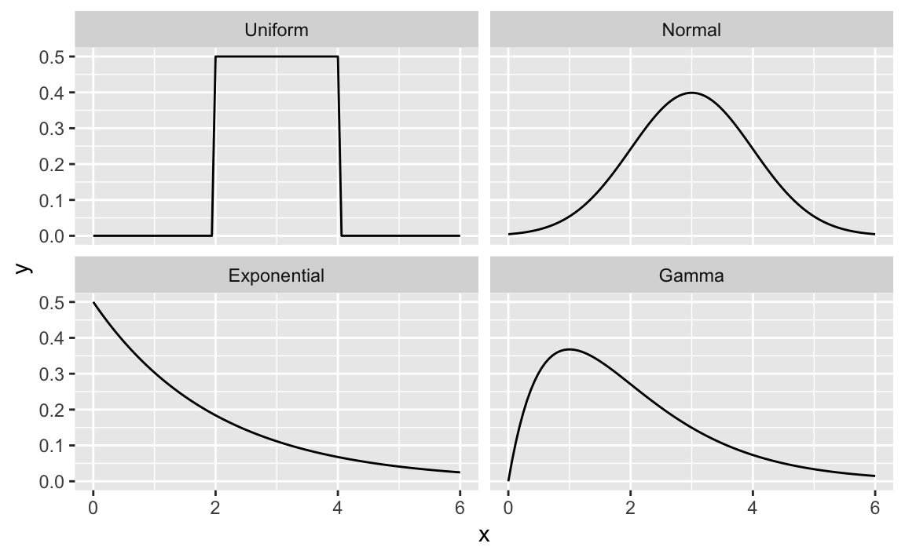
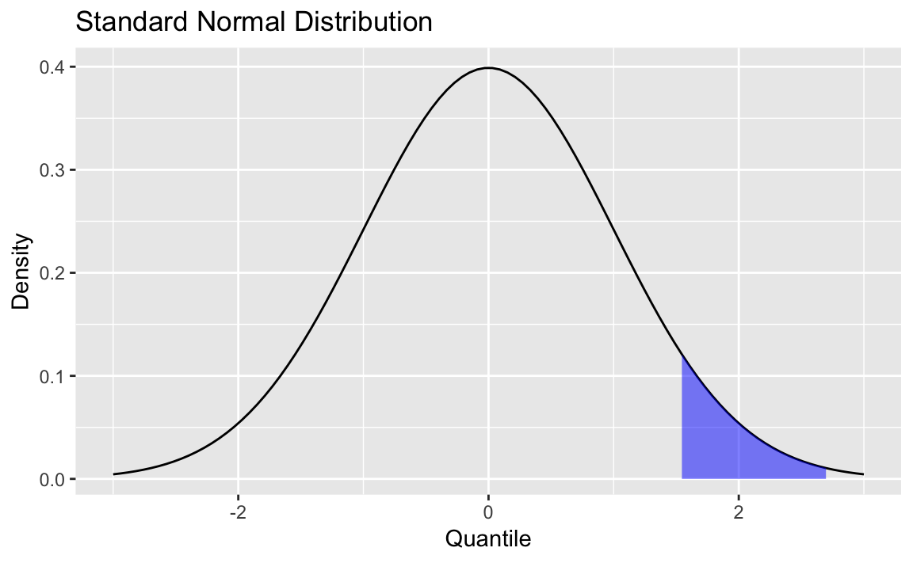
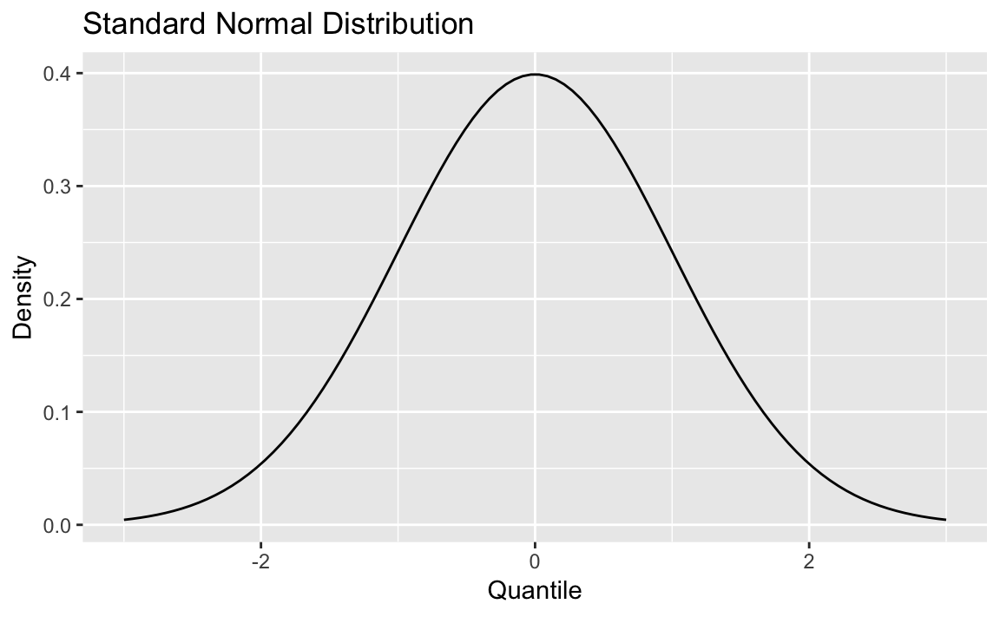

# Probability {#Probability}

Introduction {-#intro-Probability}
------------

Probability theory is the foundation of statistics, and R has plenty of
machinery for working with probability, probability distributions, and
random variables. The recipes in this chapter show you how to calculate
probabilities from quantiles, calculate quantiles from probabilities,
generate random variables drawn from distributions, plot distributions,
and so forth.

### Names of Distributions {-}

R has an abbreviated name for every probability distribution. This name
is used to identify the functions associated with the distribution. For
example, the name of the Normal distribution is “norm,” which is the
root of the function names listed in Table \@ref(tab:tbl-profunctions).

  Function   Purpose
  ---------- ------------------------------
  `dnorm`    Normal density
  `pnorm`    Normal distribution function
  `qnorm`    Normal quantile function
  `rnorm`    Normal random variates

Table: (\#tab:tbl-profunctions) Normal distribution functions

Table \@ref(tab:tbl-Discrete) describes some common discrete
distributions, and Table \@ref(tab:tbl-Continuous) describes several
common continuous distributions.

Table: (\#tab:tbl-Discrete) Common discrete distributions

|Discrete distribution|R name|Parameters |
|---|---|---|
| Binomial| `binom` | `n` = number of trials; `p` = probability of success for one trial |
|Geometric|`geom`|`p` = probability of success for one trial|
|Hypergeometric|`hyper`|`m` = number of white balls in urn; `n` = number of black balls in urn; `k` = number of balls drawn from urn|
|Negative binomial (NegBinomial)|`nbinom`|`size` = number of successful trials; either `prob` = probability of successful trial or `mu` = mean|
|Poisson|`pois`|`lambda` = mean|

Table: (\#tab:tbl-Continuous) Common continuous distributions

|Continuous distribution|R name|Parameters|
|--|--|--|
| Beta| `beta` | `shape1`; `shape2` |
|Cauchy|`cauchy`|`location`; `scale`|
|Chi-squared (Chisquare)|`chisq`|`df` = degrees of freedom|
|Exponential|`exp`|`rate`|
|F|`f`|`df1` and `df2` = degrees of freedom|
|Gamma|`gamma`|`rate`; either `rate` or `scale`|
|Log-normal (Lognormal)|`lnorm`|`meanlog` = mean on logarithmic scale; `sdlog` = standard deviation on logarithmic scale|
|Logistic|`logis`|`location`; `scale`|
|Normal|`norm`|`mean`; `sd` = standard deviation|
|Student’s *t* (TDist)|`t`|`df` = degrees of freedom|
|Uniform|`unif`|`min` = lower limit; `max` = upper limit|
|Weibull|`weibull`|`shape`; `scale`|
|Wilcoxon|`wilcox`|`m` = number of observations in first sample; `n` = number of observations in second sample|


> **Warning**
>
> All distribution-related functions require distributional parameters,
> such as `size` and `prob` for the binomial or `prob` for the
> geometric. The big “gotcha” is that the distributional parameters may
> not be what you expect. For example, we would expect the parameter of
> an exponential distribution to be *β*, the mean. The R convention,
> however, is for the exponential distribution to be defined by the rate
> = 1/*β*, so we often supply the wrong value. The moral is, study the
> help page before you use a function related to a distribution. Be sure
> you’ve got the parameters right.

### Getting Help on Probability Distributions {-}

To see the R functions related to a particular probability distribution,
use the help command and the full name of the distribution. For example,
this will show the functions related to the Normal distribution:


```r
?Normal
```

Some distributions have names that don’t work well with the help
command, such as “Student’s *t*.” They have special help names, as noted
in Tables \@ref(tab:tbl-Discrete)  and  \@ref(tab:tbl-Continuous): NegBinomial, Chisquare, Lognormal, and
TDist. Thus, to get help on the Student’s *t* distribution, use this:


```r
?TDist
```

### See Also {-}

There are many other distributions implemented in downloadable packages;
see the CRAN task view devoted to [probability
distributions](http://cran.r-project.org/web/views/Distributions.html).
The `SuppDists` package is part of the R base, and it includes 10
supplemental distributions. The `MASS` package, which is also part of
the base, provides additional support for distributions, such as
maximum-likelihood fitting for some common distributions as well as
sampling from a multivariate normal distribution.

Counting the Number of Combinations {#recipe-id163}
-----------------------------------

### Problem {-#problem-id163}

You want to calculate the number of combinations of *n* items taken *k*
at a time.

### Solution {-#solution-id163}

Use the `choose` function:


```r
choose(n, k)
```

### Discussion {-#discussion-id163}

A common problem in computing probabilities of discrete variables is
counting combinations: the number of distinct subsets of size *k* that
can be created from *n* items. The number is given by *n*!/*r*!(*n* -
*r*)!, but it’s much more convenient to use the `choose`
function—especially as *n* and *k* grow larger:


```r
choose(5, 3)   # How many ways can we select 3 items from 5 items?
#> [1] 10
choose(50, 3)  # How many ways can we select 3 items from 50 items?
#> [1] 19600
choose(50, 30) # How many ways can we select 30 items from 50 items?
#> [1] 4.71e+13
```

These numbers are also known as *binomial coefficients*.

### See Also {-#see_also-id163}

This recipe merely counts the combinations; see
Recipe \@ref(recipe-id198), ["Generating Combinations"](#recipe-id198), to actually generate them.

Generating Combinations {#recipe-id198}
-----------------------

### Problem {-#problem-id198}

You want to generate all combinations of *n* items taken *k* at a time.

### Solution {-#solution-id198}

Use the `combn` function:


```r
items <- 2:5
k <- 2
combn(items, k)
#>      [,1] [,2] [,3] [,4] [,5] [,6]
#> [1,]    2    2    2    3    3    4
#> [2,]    3    4    5    4    5    5
```

### Discussion {-#discussion-id198}

We can use `combn(1:5,3)` to generate all combinations of the numbers 1
through 5 taken three at a time:


```r
combn(1:5, 3)
#>      [,1] [,2] [,3] [,4] [,5] [,6] [,7] [,8] [,9] [,10]
#> [1,]    1    1    1    1    1    1    2    2    2     3
#> [2,]    2    2    2    3    3    4    3    3    4     4
#> [3,]    3    4    5    4    5    5    4    5    5     5
```

The function is not restricted to numbers. We can generate combinations
of strings, too. Here are all combinations of five treatments taken
three at a time:


```r
combn(c("T1", "T2", "T3", "T4", "T5"), 3)
#>      [,1] [,2] [,3] [,4] [,5] [,6] [,7] [,8] [,9] [,10]
#> [1,] "T1" "T1" "T1" "T1" "T1" "T1" "T2" "T2" "T2" "T3" 
#> [2,] "T2" "T2" "T2" "T3" "T3" "T4" "T3" "T3" "T4" "T4" 
#> [3,] "T3" "T4" "T5" "T4" "T5" "T5" "T4" "T5" "T5" "T5"
```

> **Warning**
>
> As the number of items, *n*, increases, the number of combinations can
> explode—especially if *k* is not near to 1 or *n*.

### See Also {-#see_also-id198}

See Recipe \@ref(recipe-id163), ["Counting the Number of Combinations"](#recipe-id163), to count the
number of possible combinations *before* you generate a huge set.

Generating Random Numbers {#recipe-id165}
-------------------------

### Problem {-#problem-id165}

You want to generate random numbers.

### Solution {-#solution-id165}

The simple case of generating a uniform random number between 0 and 1 is
handled by the `runif` function. This example generates one uniform
random number:


```r
runif(1)
#> [1] 0.915
```
> Note: If you are saying `runif` out loud (or even in your head), you should pronounce it "are unif" instead of "run if." The term `runif` is a *portmanteau* of "random uniform" so should not sound as if it's a flow control function. 

R can generate random variates from other distributions as well. For a
given distribution, the name of the random number generator is “r”
prefixed to the distribution’s abbreviated name (e.g., `rnorm` for the
normal distribution’s random number generator). This example generates
one random value from the standard normal distribution:


```r
rnorm(1)
#> [1] 1.53
```

### Discussion {-#discussion-id165}

Most programming languages have a wimpy random number generator that
generates one random number, uniformly distributed between 0.0 and 1.0,
and that’s all. Not R.

R can generate random numbers from many probability distributions other
than the uniform distribution. The simple case of generating uniform
random numbers between 0 and 1 is handled by the `runif` function:


```r
runif(1)
#> [1] 0.83
```

The argument of `runif` is the number of random values to be generated.
Generating a vector of 10 such values is as easy as generating one:


```r
runif(10)
#>  [1] 0.642 0.519 0.737 0.135 0.657 0.705 0.458 0.719 0.935 0.255
```

There are random number generators for all built-in distributions.
Simply prefix the distribution name with “r” and you have the name of
the corresponding random number generator. Here are some common ones:


```r
runif(1, min = -3, max = 3)      # One uniform variate between -3 and +3
#> [1] 2.49
rnorm(1)                         # One standard normal variate
#> [1] 1.53
rnorm(1, mean = 100, sd = 15)    # One normal variate, mean 100 and SD 15
#> [1] 114
rbinom(1, size = 10, prob = 0.5) # One binomial variate
#> [1] 5
rpois(1, lambda = 10)            # One Poisson variate
#> [1] 12
rexp(1, rate = 0.1)              # One exponential variate
#> [1] 3.14
rgamma(1, shape = 2, rate = 0.1) # One gamma variate
#> [1] 22.3
```

As with `runif`, the first argument is the number of random values to be
generated. Subsequent arguments are the parameters of the distribution,
such as `mean` and `sd` for the normal distribution or `size` and `prob`
for the binomial. See the function’s R help page for details.

The examples given so far use simple scalars for distributional
parameters. Yet the parameters can also be vectors, in which case R will
cycle through the vector while generating random values. The following
example generates three normal random values drawn from distributions
with means of –10, 0, and +10, respectively (all distributions have a
standard deviation of 1.0):


```r
rnorm(3, mean = c(-10, 0, +10), sd = 1)
#> [1] -9.420 -0.658 11.555
```

That is a powerful capability in cases such as hierarchical models,
where the parameters are themselves random. The next example calculates
30 draws of a normal variate whose mean is itself randomly distributed
and with hyperparameters of *μ* = 0 and *σ* = 0.2:


```r
means <- rnorm(30, mean = 0, sd = 0.2)
rnorm(30, mean = means, sd = 1)
#>  [1] -0.5549 -2.9232 -1.2203  0.6962  0.1673 -1.0779 -0.3138 -3.3165
#>  [9]  1.5952  0.8184 -0.1251  0.3601 -0.8142  0.1050  2.1264  0.6943
#> [17] -2.7771  0.9026  0.0389  0.2280 -0.5599  0.9572  0.1972  0.2602
#> [25] -0.4423  1.9707  0.4553  0.0467  1.5229  0.3176
```

If you are generating many random values and the vector of parameters is
too short, R will apply the Recycling Rule to the parameter vector.

### See Also {-#see_also-id165}

See the [Introduction](#intro-Probability) to this chapter.

Generating Reproducible Random Numbers {#recipe-id201}
--------------------------------------

### Problem {-#problem-id201}

You want to generate a sequence of random numbers, but you want to
reproduce the same sequence every time your program runs.

### Solution {-#solution-id201}

Before running your R code, call the `set.seed` function to initialize
the random number generator to a known state:


```r
set.seed(42) # Or use any other positive integer...
```

### Discussion {-#discussion-id201}

After generating random numbers, you may often want to reproduce the
same sequence of “random” numbers every time your program executes. That
way, you get the same results from run to run.
One of the authors once supported a
complicated Monte Carlo analysis of a huge portfolio of securities. The
users complained about getting slightly different results each time the
program ran. No kidding! The analysis was driven entirely by random numbers, so
of course there was randomness in the output. The solution was to set the
random number generator to a known state at the beginning of the
program. That way, it would generate the same (quasi-)random numbers
each time and thus yield consistent, reproducible results.

In R, the `set.seed` function sets the random number generator to a
known state. The function takes one argument, an integer. Any positive
integer will work, but you must use the same one in order to get the
same initial state.

The function returns nothing. It works behind the scenes, initializing
(or reinitializing) the random number generator. The key here is that
using the same seed restarts the random number generator back at the
same place:


```r
set.seed(165)   # Initialize generator to known state
runif(10)       # Generate ten random numbers
#>  [1] 0.116 0.450 0.996 0.611 0.616 0.426 0.666 0.168 0.788 0.442

set.seed(165)   # Reinitialize to the same known state
runif(10)       # Generate the same ten "random" numbers
#>  [1] 0.116 0.450 0.996 0.611 0.616 0.426 0.666 0.168 0.788 0.442
```

> **Warning**
>
> When you set the seed value and freeze your sequence of random
> numbers, you are eliminating a source of randomness that may be critical
> to algorithms such as Monte Carlo simulations. Before you call
> `set.seed` in your application, ask yourself: Am I undercutting the
> value of my program or perhaps even damaging its logic?

### See Also {-#see_also-id201}

See Recipe \@ref(recipe-id165), ["Generating Random Numbers"](#recipe-id165), for more about generating
random numbers.

Generating a Random Sample {#recipe-id199}
--------------------------

### Problem {-#problem-id199}

You want to sample a dataset randomly.

### Solution {-#solution-id199}

The `sample` function will randomly select *n* items from a set:


```r
sample(set, n)
```

### Discussion {-#discussion-id199}

Suppose your World Series data contains a vector of years when the
Series was played. You can select 10 years at random using `sample`:


```r
world_series <- read_csv("./data/world_series.csv")
sample(world_series$year, 10)
#>  [1] 2005 1929 1964 1966 1934 1969 1909 2014 1997 1987
```

The items are randomly selected, so running `sample` again (usually)
produces a different result:


```r
sample(world_series$year, 10)
#>  [1] 1973 2005 2001 1977 1953 1946 1974 1951 1956 1990
```

The `sample` function normally samples without replacement, meaning it
will not select the same item twice. Some statistical procedures
(especially the bootstrap) require sampling *with* replacement, which
means that one item can appear multiple times in the sample. Specify
`replace=TRUE` to sample with replacement.

It’s easy to implement a simple bootstrap using sampling with
replacement.
Suppose we have a vector, `x`, of 1,000 random numbers,
drawn from a normal distribution with mean 4 and standard deviation 10.


```r
set.seed(42)
x <- rnorm(1000, 4, 10)
```

This code fragment samples 1,000 times from `x` and
calculates the median of each sample:


```r
medians <- numeric(1000)   # empty vector of 1000 numbers
for (i in 1:1000) {
  medians[i] <- median(sample(x, replace = TRUE))
}
```

From the bootstrap estimates, we can estimate the confidence interval
for the median:


```r
ci <- quantile(medians, c(0.025, 0.975))
cat("95% confidence interval is (", ci, ")\n")
#> 95% confidence interval is ( 3.15 4.5 )
```

We know that `x` was created from a normal distribution with a mean of 4
and, hence, the sample median should be 4 also.
(In a symmetrical distribution like the normal, the mean and the median are the same.)
Our confidence interval easily contains the value.

### See Also {-#see_also-id199}

See Recipe \@ref(recipe-id151), ["Randomly Permuting a Vector"](#recipe-id151), for randomly permuting
a vector and Recipe \@ref(recipe-id159), ["Bootstrapping a Statistic"](#recipe-id159), for more about bootstrapping. Recipe \@ref(recipe-id201), ["Generating Reproducible Random Numbers"](#recipe-id201), discusses setting seeds for quasi-random numbers.

Generating Random Sequences {#recipe-id200}
---------------------------

### Problem {-#problem-id200}

You want to generate a random sequence, such as a series of simulated
coin tosses or a simulated sequence of Bernoulli trials.

### Solution {-#solution-id200}

Use the `sample` function. Sample *n* draws from the set of possible values, and
set `replace=TRUE`:


```r
sample(set, n, replace = TRUE)
```

### Discussion {-#discussion-id200}

The `sample` function randomly selects items from a set. It normally
samples *without* replacement, which means that it will not select the
same item twice and will return an error if you try to sample more items than exist in the set. With `replace=TRUE`, however, `sample` can select items
over and over; this allows you to generate long, random sequences of
items.

The following example generates a random sequence of 10 simulated flips
of a coin:


```r
sample(c("H", "T"), 10, replace = TRUE)
#>  [1] "H" "H" "T" "H" "H" "H" "T" "H" "T" "T"
```

The next example generates a sequence of 20 Bernoulli trials—random
successes or failures. We use `TRUE` to signify a success:


```r
sample(c(FALSE, TRUE), 20, replace = TRUE)
#>  [1]  TRUE FALSE  TRUE FALSE  TRUE FALSE  TRUE  TRUE  TRUE FALSE  TRUE
#> [12] FALSE  TRUE FALSE FALSE FALSE FALSE FALSE FALSE FALSE
```

By default, `sample` will choose equally among the set elements and so
the probability of selecting either `TRUE` or `FALSE` is 0.5. With a
Bernoulli trial, the probability *p* of success is not necessarily 0.5.
You can bias the sample by using the `prob` argument of `sample`; this
argument is a vector of probabilities, one for each set element. Suppose
we want to generate 20 Bernoulli trials with a probability of success
*p* = 0.8. We set the probability of `FALSE` to be 0.2 and the
probability of `TRUE` to 0.8:


```r
sample(c(FALSE, TRUE), 20, replace = TRUE, prob = c(0.2, 0.8))
#>  [1]  TRUE  TRUE  TRUE  TRUE  TRUE  TRUE  TRUE FALSE  TRUE FALSE  TRUE
#> [12]  TRUE  TRUE FALSE  TRUE  TRUE  TRUE  TRUE  TRUE FALSE
```

The resulting sequence is clearly biased toward `TRUE`. We chose this
example because it’s a simple demonstration of a general technique. For
the special case of a binary-valued sequence you can use `rbinom`, the
random generator for binomial variates:


```r
rbinom(10, 1, 0.8)
#>  [1] 1 0 1 0 0 1 1 1 1 1
```

Randomly Permuting a Vector {#recipe-id151}
---------------------------

### Problem {-#problem-id151}

You want to generate a random permutation of a vector.

### Solution {-#solution-id151}

If `v` is your vector, then `sample(v)` returns a random permutation.

### Discussion {-#discussion-id151}

We typically think of the `sample` function for sampling from large datasets.
However, the default parameters enable you to create a random
rearrangement of the dataset. The function call `sample(v)` is
equivalent to:


```r
sample(v, size = length(v), replace = FALSE)
```

which means “select all the elements of `v` in random order while using
each element exactly once.” That is a random permutation. Here is a
random permutation of 1, ..., 10:


```r
sample(1:10)
#>  [1]  2  7 10  5  6  3  4  1  9  8
```

### See Also {-#see_also-id151}

See Recipe \@ref(recipe-id199), ["Generating a Random Sample"](#recipe-id199), for more about `sample`.

Calculating Probabilities for Discrete Distributions {#recipe-id196}
----------------------------------------------------

### Problem {-#problem-id196}

You want to calculate either the simple or the cumulative probability
associated with a discrete random variable.

### Solution {-#solution-id196}

For a simple probability, *P*(*X* = *x*), use the density function. All
built-in probability distributions have a density function whose name is
“d” prefixed to the distribution name. For example, `dbinom` for the
binomial distribution.

For a cumulative probability, *P*(*X* ≤ *x*), use the distribution
function. All built-in probability distributions have a distribution
function whose name is “p” prefixed to the distribution name; thus,
`pbinom` is the distribution function for the binomial distribution.

### Discussion {-#discussion-id196}

Suppose we have a binomial random variable *X* over 10 trials, where
each trial has a success probability of 1/2. Then we can calculate the
probability of observing *x* = 7 by calling `dbinom`:


```r
dbinom(7, size = 10, prob = 0.5)
#> [1] 0.117
```

That calculates a probability of about 0.117. R calls `dbinom` the
*density function*. Some textbooks call it the *probability mass function*
or the *probability function*. Calling it a density function keeps the
terminology consistent between discrete and continuous distributions
(see Recipe \@ref(recipe-id197), ["Calculating Probabilities for Continuous Distributions"](#recipe-id197)).

The cumulative probability, *P*(*X* ≤ *x*), is given by the *distribution
function*, which is sometimes called the *cumulative probability function*.
The distribution function for the binomial distribution is `pbinom`.
Here is the cumulative probability for *x* = 7 (i.e., *P*(*X* ≤ 7)):


```r
pbinom(7, size = 10, prob = 0.5)
#> [1] 0.945
```

It appears the probability of observing *X* ≤ 7 is about 0.945.

The density functions and distribution functions for some
common discrete distributions are shown in Table \@ref(tab:distributions).

Table: (\#tab:distributions) Discrete distributions

  Distribution   Density function: *P*(*X* = *x*)   Distribution function: *P*(*X* ≤ *x*)
  -------------- ---------------------------------- ---------------------------------------
  Binomial       `dbinom(*x*, *size*, *prob*)`            `pbinom(*x*, *size*, *prob*)`
  Geometric      `dgeom(*x*, *prob*)`                     `pgeom(*x*, *prob*)`
  Poisson        `dpois(*x*, *lambda*)`                   `ppois(*x*, *lambda*)`


The complement of the cumulative probability is the *survival function*,
*P*(*X* &gt; *x*). All of the distribution functions let you find this
right-tail probability simply by specifying `lower.tail=FALSE`:


```r
pbinom(7, size = 10, prob = 0.5, lower.tail = FALSE)
#> [1] 0.0547
```

Thus we see that the probability of observing *X* > 7 is about 0.055.

The *interval probability*, *P*(*x*~1~ &lt; *X* ≤ *x*~2~), is the
probability of observing *X* between the limits *x*~1~ and *x*~2~. It is calculated as the difference between two cumulative
probabilities: *P*(*X* ≤ *x*~2~) – *P*(*X* ≤ *x*~1~). Here is *P*(3 &lt;
*X* ≤ 7) for our binomial variable:


```r
pbinom(7, size = 10, prob = 0.5) - pbinom(3, size = 10, prob = 0.5)
#> [1] 0.773
```

R lets you specify multiple values of *x* for these functions and will
return a vector of the corresponding probabilities. Here we calculate
two cumulative probabilities, *P*(*X* ≤ 3) and *P*(*X* ≤ 7), in one call
to `pbinom`:


```r
pbinom(c(3, 7), size = 10, prob = 0.5)
#> [1] 0.172 0.945
```

This leads to a one-liner for calculating interval probabilities. The
`diff` function calculates the difference between successive elements of
a vector. We apply it to the output of `pbinom` to obtain the difference
in cumulative probabilities—in other words, the interval probability:


```r
diff(pbinom(c(3, 7), size = 10, prob = 0.5))
#> [1] 0.773
```

### See Also {-#see_also-id196}

See this chapter’s [Introduction](#intro-Probability) for more about the
built-in probability distributions.

Calculating Probabilities for Continuous Distributions {#recipe-id197}
------------------------------------------------------

### Problem {-#problem-id197}

You want to calculate the distribution function (DF) or cumulative
distribution function (CDF) for a continuous random variable.

### Solution {-#solution-id197}

Use the distribution function, which calculates *P*(*X* ≤ *x*). All
built-in probability distributions have a distribution function whose
name is “p” prefixed to the distribution’s abbreviated name—for
instance, `pnorm` for the normal distribution.

Example: what's the probability of a draw being below .8 for a draw from a random standard normal distribution? 

```r
pnorm(q = .8, mean = 0, sd = 1)
#> [1] 0.788
```

### Discussion {-#discussion-id197}

The R functions for probability distributions follow a consistent
pattern, so the solution to this recipe is essentially identical to the
solution for discrete random variables
(see Recipe \@ref(recipe-id196), ["Calculating Probabilities for Discrete Distributions"](#recipe-id196)).
The significant difference is that continuous variables have no
“probability” at a single point, *P*(*X* = *x*). Instead, they have a
density at a point.

Given that consistency, the discussion of distribution functions in
Recipe \@ref(recipe-id196), ["Calculating Probabilities for Discrete Distributions"](#recipe-id196), is
applicable here, too. Table \@ref(tab:continuous) gives the distribution
functions for several continuous distributions.

Table: (\#tab:continuous) Continuous distributions

  Distribution         Distribution function: *P*(*X* ≤ *x*)
  -------------------- ---------------------------------------
  Normal               `pnorm(*x*, *mean*, *sd*)`
  Student’s *t*        `pt(*x*, *df*)`
  Exponential          `pexp(*x*, *rate*)`
  Gamma                `pgamma(*x*, *shape*, *rate*)`
  Chi-squared (χ^2^)   `pchisq(*x*, *df*)`

We can use `pnorm` to calculate the probability that a man is shorter
than 66 inches, assuming that men’s heights are normally distributed
with a mean of 70 inches and a standard deviation of 3 inches.
Mathematically speaking, we want *P*(*X* ≤ 66) given that *X* \~ *N*(70,
3):


```r
pnorm(66, mean = 70, sd = 3)
#> [1] 0.0912
```

Likewise, we can use `pexp` to calculate the probability that an
exponential variable with a mean of 40 could be less than 20:


```r
pexp(20, rate = 1 / 40)
#> [1] 0.393
```

Just as for discrete probabilities, the functions for continuous
probabilities use `lower.tail=FALSE` to specify the survival function,
*P*(*X* &gt; *x*). This call to `pexp` gives the probability that the
same exponential variable could be greater than 50:


```r
pexp(50, rate = 1 / 40, lower.tail = FALSE)
#> [1] 0.287
```

Also like discrete probabilities, the interval probability for a
continuous variable, *P*(*x*~1~ &lt; *X* &lt; *x*~2~), is computed as
the difference between two cumulative probabilities, *P*(*X* &lt;
*x*~2~) – *P*(*X* &lt; *x*~1~). For the same exponential variable, here
is *P*(20 &lt; *X* &lt; 50), the probability that it could fall between
20 and 50:


```r
pexp(50, rate = 1 / 40) - pexp(20, rate = 1 / 40)
#> [1] 0.32
```

### See Also {-#see_also-id197}

See this chapter’s [Introduction](#intro-Probability) for more about the
built-in probability distributions.

Converting Probabilities to Quantiles {#recipe-id168}
-------------------------------------

### Problem {-#problem-id168}

Given a probability *p* and a distribution, you want to determine the
corresponding quantile for *p*: the value *x* such that *P*(*X* ≤ *x*) =
*p*.

### Solution {-#solution-id168}

Every built-in distribution includes a quantile function that converts
probabilities to quantiles. The function’s name is “q” prefixed to the
distribution name; thus, for instance, `qnorm` is the quantile function
for the normal distribution.

The first argument of the quantile function is the probability. The
remaining arguments are the distribution’s parameters, such as `mean`,
`shape`, or `rate`:


```r
qnorm(0.05, mean = 100, sd = 15)
#> [1] 75.3
```

### Discussion {-#discussion-id168}

A common example of computing quantiles is when we compute the limits of
a confidence interval. If we want to know the 95% confidence interval
(*α* = 0.05) of a standard normal variable, then we need the quantiles
with probabilities of *α*/2 = 0.025 and (1 – *α*)/2 = 0.975:


```r
qnorm(0.025)
#> [1] -1.96
qnorm(0.975)
#> [1] 1.96
```

In the true spirit of R, the first argument of the quantile functions
can be a vector of probabilities, in which case we get a vector of
quantiles. We can simplify this example into a one-liner:


```r
qnorm(c(0.025, 0.975))
#> [1] -1.96  1.96
```

All the built-in probability distributions provide a quantile function.
Table \@ref(tab:discrete-quant-dist) shows the quantile functions for some common discrete distributions.

Table: (\#tab:discrete-quant-dist) Discrete quantile distributions

  Distribution   Quantile function
  -------------- -----------------------
  Binomial       `qbinom(*p*, *size*, *prob*)`
  Geometric      `qgeom(*p*, *prob*)`
  Poisson        `qpois(*p*, *lambda*)`

Table \@ref(tab:cont-quant-dist) shows the quantile functions for common continuous distributions.

Table: (\#tab:cont-quant-dist) Continuous quantile distributions

  Distribution         Quantile function
  -------------------- --------------------------------------------------------------
  Normal               `qnorm(*p*, *mean*, *sd*)`
  Student’s *t*        `qt(*p*, *df*)`
  Exponential          `qexp(*p*, *rate*)`
  Gamma                `qgamma(*p*, *shape*, *rate*=*rate*)` or `qgamma(*p*, *shape*, *scale*=*scale*)`
  Chi-squared (χ^2^)   `qchisq(*p*, *df*)`

### See Also {-#see-also-id168}

Determining the quantiles of a dataset is different from determining
the quantiles of a distribution—see Recipe \@ref(recipe-id143), ["Calculating Quantiles (and Quartiles) of a Dataset"](#recipe-id143).

Plotting a Density Function {#recipe-id166}
---------------------------

### Problem {-#problem-id166}

You want to plot the density function of a probability distribution.

### Solution {-#solution-id166}

Define a vector `x` over the domain. Apply the distribution’s density
function to `x` and then plot the result. If `x` is a vector of points over the domain we care about plotting, we then calculate the density using one of the `d_____` density functions, like `dlnorm` for lognormal or `dnorm` for normal. 


```r
dens <- data.frame(x = x, 
                   y = d_____(x))
ggplot(dens, aes(x, y)) + geom_line()
```
Here is a specific example that plots the
standard normal distribution for the interval –3 to +3:


```r
library(ggplot2)

x <- seq(-3, +3, 0.1)
dens <- data.frame(x = x, y = dnorm(x))

ggplot(dens, aes(x, y)) + geom_line()
```

<div class="figure" style="text-align: center">

<p class="caption">(\#fig:std-norm)Smooth density function</p>
</div>
Figure \@ref(fig:std-norm) shows the smooth density function.

### Discussion {-#discussion-id166}

All the built-in probability distributions include a density function.
For a particular density, the function name is “d” prepended to the
density name. The density function for the normal distribution is
`dnorm`, the density for the gamma distribution is `dgamma`, and so
forth.

If the first argument of the density function is a vector, then the
function calculates the density at each point and returns the vector of
densities.

The following code creates a 2 × 2 plot of four densities:


```r
x <- seq(from = 0, to = 6, length.out = 100) # Define the density domains
ylim <- c(0, 0.6)

# Make a data.frame with densities of several distributions
df <- rbind(
  data.frame(x = x, dist_name = "Uniform"    , y = dunif(x, min   = 2, max = 4)),
  data.frame(x = x, dist_name = "Normal"     , y = dnorm(x, mean  = 3, sd = 1)),
  data.frame(x = x, dist_name = "Exponential", y = dexp(x, rate  = 1 / 2)),
  data.frame(x = x, dist_name = "Gamma"      , y = dgamma(x, shape = 2, rate = 1)) )

# Make a line plot like before, but use facet_wrap to create the grid
ggplot(data = df, aes(x = x, y = y)) +
  geom_line() +
  facet_wrap(~dist_name)   # facet and wrap by the variable dist_name
```

<div class="figure" style="text-align: center">

<p class="caption">(\#fig:densities)Multiple density plots</p>
</div>

Figure \@ref(fig:densities) shows four density plots. However, a raw density plot is rarely useful or interesting by itself, and we often shade a region of interest.

<div class="figure" style="text-align: center">

<p class="caption">(\#fig:densityshaded)Standard normal with shading</p>
</div>

Figure \@ref(fig:densityshaded) is a normal distribution with shading from the 75^th^ percentile to the 95^th^ percentile. 

We create the plot by first plotting the density and then creating a shaded
region with the `geom_ribbon` function from `ggplot2`. 

First, we create some data and draw the density curve like the one shown in Figure \@ref(fig:normalden1) 


```r
x <- seq(from = -3, to = 3, length.out = 100)
df <- data.frame(x = x, y = dnorm(x, mean = 0, sd = 1))

p <- ggplot(df, aes(x, y)) +
  geom_line() +
  labs(
    title = "Standard Normal Distribution",
    y = "Density",
    x = "Quantile"
  )
p
```

<div class="figure" style="text-align: center">

<p class="caption">(\#fig:normalden1)Density plot</p>
</div>

Next, we define the region of interest by calculating the `x` value for the quantiles we're interested in. Finally, we use a `geom_ribbon` to add a subset of our original data as a colored region. The resulting plot is shown in Figure \@ref(fig:normalden2).


```r
q75 <- quantile(df$x, .75)
q95 <- quantile(df$x, .95)

p +
  geom_ribbon(
    data = subset(df, x > q75 & x < q95),
    aes(ymax = y),
    ymin = 0,
    fill = "blue",
    colour = NA,
    alpha = 0.5
  )
```

<div class="figure" style="text-align: center">

<p class="caption">(\#fig:normalden2)Normal density with shading</p>
</div>

