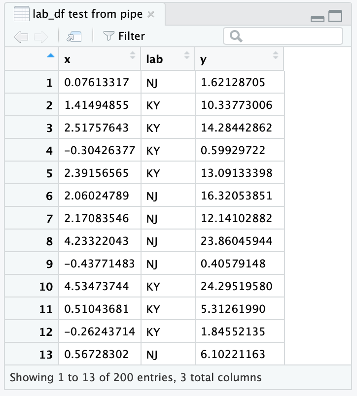

# Useful Tricks {#UsefulTricks}

Introduction {-#intro-UsefulTricks}
------------

The recipes in this chapter are neither obscure numerical calculations
nor deep statistical techniques. Yet they are useful functions and
idioms that you will likely need at one time or another.

Peeking at Your Data {#recipe-id278}
--------------------

### Problem {-#problem-id278}

You have a lot of data—too much to display at once. Nonetheless, you
want to see some of the data.

### Solution {-#solution-id278}

Use `head` to view the first few data values or rows:


```r
head(x)
```

Use `tail` to view the last few data values or rows:


```r
tail(x)
```

Or you can view the whole thing in an interactive viewer in RStudio:

```r
View(x)
```

### Discussion {-#discussion-id278}

Printing a large dataset is pointless because everything just rolls off
your screen. Use `head` to see a little bit of the data (six rows by default):


```r
load(file = './data/lab_df.rdata')
head(lab_df)
#>         x lab      y
#> 1  0.0761  NJ  1.621
#> 2  1.4149  KY 10.338
#> 3  2.5176  KY 14.284
#> 4 -0.3043  KY  0.599
#> 5  2.3916  KY 13.091
#> 6  2.0602  NJ 16.321
```

Use `tail` to see the last few rows and the number of rows:


```r
tail(lab_df)
#>          x lab      y
#> 195  7.353  KY 38.880
#> 196 -0.742  KY -0.298
#> 197  2.116  NJ 11.629
#> 198  1.606  KY  9.408
#> 199 -0.523  KY -1.089
#> 200  0.675  KY  5.808
```

Both `head` and `tail` allow you to pass a number to the function to set the number of rows returned:

```r
tail(lab_df, 2)
#>          x lab     y
#> 199 -0.523  KY -1.09
#> 200  0.675  KY  5.81
```

RStudio comes with an interactive viewer built in. You can call the viewer from the console or a script:


```r
View(lab_df)
```

Or you can pipe an object to the viewer:


```r
lab_df %>%
  View()
```

When piping to `View` you will notice that the viewer names the View tab simply `.` (just a dot). To get a more informative name, you can put a descriptive name in quotes:


```r
lab_df %>%
  View("lab_df test from pipe")
```

The resulting RStudio viewer is shown in Figure \@ref(fig:rstudioview).

<div class="figure" style="text-align: center">

<p class="caption">(\#fig:rstudioview)RStudio viewer</p>
</div>

### See Also {-#see_also-id278}

See Recipe \@ref(recipe-id202), ["Revealing the Structure of an Object"](#recipe-id202) for seeing the
structure of your variable’s contents.

Printing the Result of an Assignment {#recipe-id271}
------------------------------------

### Problem {-#problem-id271}

You are assigning a value to a variable and you want to see its value.

### Solution {-#solution-id271}

Simply put parentheses around the assignment:


```r
x <- 1/pi            # Prints nothing
(x <- 1/pi)          # Prints assigned value
#> [1] 0.318
```

### Discussion {-#discussion-id271}

Normally, R inhibits printing when it sees you enter a simple
assignment. When you surround the assignment with parentheses, however,
it is no longer a simple assignment and so R prints the value. This can be very handy for quick debugging in a script. 

### See Also {-#see_also-id271}

See Recipe \@ref(recipe-id017), ["Printing Something to the Screen"](#recipe-id017), for more ways to print things.

Summing Rows and Columns {#recipe-id138}
------------------------

### Problem {-#problem-id138}

You want to sum the rows or columns of a matrix or data frame.

### Solution {-#solution-id138}

Use `rowSums` to sum the rows:


```r
rowSums(m)
```

Use `colSums` to sum the columns:


```r
colSums(m)
```

### Discussion {-#discussion-id138}

This is a mundane recipe, but it’s so common that it deserves
mentioning. We use this recipe, for example, when producing reports that
include column totals. In this example, `daily.prod` is a record of this
week’s factory production and we want totals by product and by day:


```r
load(file = './data/daily.prod.rdata')
daily.prod
#>     Widgets Gadgets Thingys
#> Mon     179     167     182
#> Tue     153     193     166
#> Wed     183     190     170
#> Thu     153     161     171
#> Fri     154     181     186
colSums(daily.prod)
#> Widgets Gadgets Thingys 
#>     822     892     875
rowSums(daily.prod)
#> Mon Tue Wed Thu Fri 
#> 528 512 543 485 521
```

These functions return a vector. In the case of column sums, we can
append the vector to the matrix and thereby neatly print the data and
totals together:


```r
rbind(daily.prod, Totals=colSums(daily.prod))
#>        Widgets Gadgets Thingys
#> Mon        179     167     182
#> Tue        153     193     166
#> Wed        183     190     170
#> Thu        153     161     171
#> Fri        154     181     186
#> Totals     822     892     875
```

Printing Data in Columns {#recipe-id112}
------------------------

### Problem {-#problem-id112}

You have several parallel data vectors, and you want to print them in
columns.

### Solution {-#solution-id112}

Use `cbind` to form the data into columns, then print the result.

### Discussion {-#discussion-id112}

When you have parallel vectors, it’s difficult to see their relationship
if you print them separately:


```r
load(file = './data/xy.rdata')
print(x)
#>  [1] -0.626  0.184 -0.836  1.595  0.330 -0.820  0.487  0.738  0.576 -0.305
print(y)
#>  [1]  1.5118  0.3898 -0.6212 -2.2147  1.1249 -0.0449 -0.0162  0.9438
#>  [9]  0.8212  0.5939
```

Use the `cbind` function to form them into columns that, when printed,
show the data’s structure:


```r
print(cbind(x,y))
#>            x       y
#>  [1,] -0.626  1.5118
#>  [2,]  0.184  0.3898
#>  [3,] -0.836 -0.6212
#>  [4,]  1.595 -2.2147
#>  [5,]  0.330  1.1249
#>  [6,] -0.820 -0.0449
#>  [7,]  0.487 -0.0162
#>  [8,]  0.738  0.9438
#>  [9,]  0.576  0.8212
#> [10,] -0.305  0.5939
```

You can include expressions in the output, too. Use a tag to give them a
column heading:


```r
print(cbind(x, y, Total = x + y))
#>            x       y  Total
#>  [1,] -0.626  1.5118  0.885
#>  [2,]  0.184  0.3898  0.573
#>  [3,] -0.836 -0.6212 -1.457
#>  [4,]  1.595 -2.2147 -0.619
#>  [5,]  0.330  1.1249  1.454
#>  [6,] -0.820 -0.0449 -0.865
#>  [7,]  0.487 -0.0162  0.471
#>  [8,]  0.738  0.9438  1.682
#>  [9,]  0.576  0.8212  1.397
#> [10,] -0.305  0.5939  0.289
```

Binning Your Data {#recipe-id137}
-----------------

### Problem {-#problem-id137}

You have a vector, and you want to split the data into groups according
to intervals. Statisticians call this *binning* your data.

### Solution {-#solution-id137}

Use the `cut` function. You must define a vector, say `breaks`, that
gives the ranges of the intervals. The `cut` function will group your
data according to those intervals. It returns a factor whose levels
(elements) identify each datum’s group:


```r
f <- cut(x, breaks)
```

### Discussion {-#discussion-id137}

This example generates 1,000 random numbers that have a standard normal
distribution. It breaks them into six groups by defining intervals at
±1, ±2, and ±3 standard deviations:


```r
x <- rnorm(1000)
breaks <- c(-3, -2, -1, 0, 1, 2, 3)
f <- cut(x, breaks)
```

The result is a factor, `f`, that identifies the groups. The `summary`
function shows the number of elements by level. R creates names for each
level, using the mathematical notation for an interval:


```r
summary(f)
#> (-3,-2] (-2,-1]  (-1,0]   (0,1]   (1,2]   (2,3]    NA's 
#>      25     147     341     332     132      18       5
```

The results are bell-shaped, which is what we expect from the `rnorm` function. There are five `NA`
values, indicating that two values in `x` fell outside the defined
intervals.

We can use the `labels` parameter to give nice, predefined names to the
six groups instead of the funky synthesized names:


```r
f <- cut(x, breaks, labels = c("Bottom", "Low", "Neg", "Pos", "High", "Top"))
```

Now the `summary` function uses our names:


```r
summary(f)
#> Bottom    Low    Neg    Pos   High    Top   NA's 
#>     25    147    341    332    132     18      5
```

Binning is useful for summaries such as histograms. But it results in
information loss, which can be harmful in modeling. Consider the extreme
case of binning a continuous variable into two values, `high` and `low`.
The binned data has only two possible values, so you have replaced a
rich source of information with *one bit* of information. Where the
continuous variable might be a powerful predictor, the binned variable
can distinguish at most two states and so will likely have only a
fraction of the original power. Before you bin, we suggest exploring
other transformations that are less lossy.

Finding the Position of a Particular Value {#recipe-id116}
------------------------------------------

### Problem {-#problem-id116}

You have a vector. You know a particular value occurs in the contents,
and you want to know its position.

### Solution {-#solution-id116}

The `match` function will search a vector for a particular value and
return the position:


```r
vec <- c(100, 90, 80, 70, 60, 50, 40, 30, 20, 10)
match(80, vec)
#> [1] 3
```

Here `match` returns `3`, which is the position of `80` within `vec`.

### Discussion {-#discussion-id116}

There are special functions for finding the location of the minimum and
maximum values—`which.min` and `which.max`, respectively:


```r
vec <- c(100,90,80,70,60,50,40,30,20,10)
which.min(vec)          # Position of smallest element
#> [1] 10
which.max(vec)          # Position of largest element
#> [1] 1
```

### See Also {-#see_also-id116}

This technique is used in Recipe \@ref(recipe-id210), ["Finding the Best Power Transformation"](#recipe-id210).

Selecting Every nth Element of a Vector {#recipe-id103}
---------------------------------------

### Problem {-#problem-id103}

You want to select every *n*th element of a vector.

### Solution {-#solution-id103}

Create a logical indexing vector that is `TRUE` for every *n*th element.
One approach is to find all subscripts that equal zero when taken modulo
*n*:


```r
v[seq_along(v) %% n == 0]
```

### Discussion {-#discussion-id103}

This problem arises in systematic sampling: we want to sample a dataset
by selecting every *n*th element. The `seq_along(v)` function generates
the sequence of integers that can index `v`; it is equivalent to
`1:length(v)`. We compute each index value modulo *n* by the expression:


```r
v <- rnorm(10)
n <- 2
seq_along(v) %% n
#>  [1] 1 0 1 0 1 0 1 0 1 0
```

Then we find those values that equal zero:


```r
seq_along(v) %% n == 0
#>  [1] FALSE  TRUE FALSE  TRUE FALSE  TRUE FALSE  TRUE FALSE  TRUE
```

The result is a logical vector, the same length as `v` and with `TRUE`
at every *n*th element, that can index `v` to select the desired
elements:


```r
v
#>  [1]  2.325  0.524  0.971  0.377 -0.996 -0.597  0.165 -2.928 -0.848  0.799
v[ seq_along(v) %% n == 0 ]
#> [1]  0.524  0.377 -0.597 -2.928  0.799
```

If you just want something simple like every second element, you can use
the Recycling Rule in a clever way. Index `v` with a two-element logical
vector, like this:


```r
v[c(FALSE, TRUE)]
#> [1]  0.524  0.377 -0.597 -2.928  0.799
```

If `v` has more than two elements, then the indexing vector is too short.
Hence, R will invoke the Recycling Rule and expand the index vector to
the length of `v`, recycling its contents. That gives an index vector
that is `FALSE`, `TRUE`, `FALSE`, `TRUE`, `FALSE`, `TRUE`, and so forth.
Voilà! The final result is every second element of `v`.

### See Also {-#see_also-id103}

See Recipe \@ref(recipe-id050), ["Understanding the Recycling Rule"](#recipe-id050), for more about the Recycling Rule.

Finding Minimums or Maximums {#recipe-id107}
-------------------------------------

### Problem {-#problem-id107}

You have two vectors, *v* and *w*, and you want to find the minimums or
the maximums of pairwise elements. That is, you want to calculate:

> min(*v*~1~, *w*~1~), min(*v*~2~, *w*~2~), min(*v*~3~, *w*~3~), ...

or:

> max(*v*~1~, *w*~1~), max(*v*~2~, *w*~2~), max(*v*~3~, *w*~3~), ...

### Solution {-#solution-id107}

R calls these the *parallel minimum* and the *parallel maximum*. The
calculation is performed by `pmin(v,w)` and `pmax(v,w)`, respectively:


```r
pmin(1:5, 5:1)    # Find the element-by-element minimum
#> [1] 1 2 3 2 1
pmax(1:5, 5:1)    # Find the element-by-element maximum
#> [1] 5 4 3 4 5
```

### Discussion {-#discussion-id107}

When an R beginner wants pairwise minimums or maximums, a common mistake
is to write `min(v,w)` or `max(v,w)`. Those are not pairwise operations:
`min(v,w)` returns a single value, the minimum over all `v` and `w`.
Likewise, `max(v,w)` returns a single value from all of `v` and `w`.

The `pmin` and `pmax` values compare their arguments in parallel,
picking the minimum or maximum for each subscript. They return a vector
that matches the length of the inputs.

You can combine `pmin` and `pmax` with the Recycling Rule to perform
useful hacks. Suppose the vector `v` contains both positive and negative
values, and you want to reset the negative values to zero. This does the
trick:


```r
v <- c(-3:3)
v
#> [1] -3 -2 -1  0  1  2  3
v <- pmax(v, 0)
v
#> [1] 0 0 0 0 1 2 3
```

By the Recycling Rule, R expands the zero-valued scalar into a vector of
zeros that is the same length as `v`. Then `pmax` does an
element-by-element comparison, taking the larger of zero and each
element of `v`.

Actually, `pmin` and `pmax` are more powerful than the Solution
indicates. They can take more than two vectors, comparing all vectors in
parallel.

It is not uncommon to use `pmin` or `pmax` to calculate a new variable in a data frame based on multiple fields. Let's look at a quick example:


```r
df <- data.frame(a = c(1,5,8), 
                 b = c(2,3,7),
                 c = c(0,4,9))
df %>%
  mutate(max_val = pmax(a,b,c))
#>   a b c max_val
#> 1 1 2 0       2
#> 2 5 3 4       5
#> 3 8 7 9       9
```

We can see the new column, `max_val`, now contains the row-by-row max value from the three input columns. 

### See Also {-#see_also-id107}

See Recipe \@ref(recipe-id050), ["Understanding the Recycling Rule"](#recipe-id050), for more about the Recycling Rule.

Generating All Combinations of Several Variables {#recipe-id110}
----------------------------------------------

### Problem {-#problem-id110}

You have two or more variables. You want to generate all combinations of
their levels, also known as their *Cartesian product*.

### Solution {-#solution-id110}

Use the `expand.grid` function. Here, `f` and `g` are vectors:


```r
expand.grid(f, g)
```

### Discussion {-#discussion-id110}

This code snippet creates two vectors—`sides` represents the two sides
of a coin, and `faces` represents the six faces of a die (those little
spots on a die are called *pips*):


```r
sides <- c("Heads", "Tails")
faces <- c("1 pip", paste(2:6, "pips"))
```

We can use `expand.grid` to find all combinations of one roll of the die
and one coin toss:


```r
expand.grid(faces, sides)
#>      Var1  Var2
#> 1   1 pip Heads
#> 2  2 pips Heads
#> 3  3 pips Heads
#> 4  4 pips Heads
#> 5  5 pips Heads
#> 6  6 pips Heads
#> 7   1 pip Tails
#> 8  2 pips Tails
#> 9  3 pips Tails
#> 10 4 pips Tails
#> 11 5 pips Tails
#> 12 6 pips Tails
```

Similarly, we could find all combinations of two dice. But we won't print the output here because it's 36 lines long:


```r
expand.grid(faces, faces)
```

The result of `expand.grid` is a data frame. R automatically provides the row names and
column names.

The Solution and the example show the Cartesian product of two vectors,
but `expand.grid` can handle three or more factors, too.

### See Also {-#see_also-id110}

If you’re working with strings and want a bit more control over how you bring the combinations together, then you can also use Recipe \@ref(recipe-id109), 
["Generating All Pairwise Combinations of Strings"](#recipe-id109), to generate combinations.

Flattening a Data Frame {#recipe-id153}
--------------------

### Problem {-#problem-id153}

You have a data frame of numeric values. You want to process all its
elements together, not as separate columns—for example, to find the mean
across all values.

### Solution {-#solution-id153}

Convert the data frame to a matrix and then process the matrix. This
example finds the mean of all elements in the data frame `dfrm`:


```r
mean(as.matrix(dfrm))
```

It is sometimes necessary then to convert the matrix to a vector. In
that case, use `as.vector(as.matrix(dfrm))`.

### Discussion {-#discussion-id153}

Suppose we have a data frame, such as the factory production data from Recipe \@ref(recipe-id138), ["Summing Rows and Columns"](#recipe-id138):


```r
load(file = './data/daily.prod.rdata')
daily.prod
#>     Widgets Gadgets Thingys
#> Mon     179     167     182
#> Tue     153     193     166
#> Wed     183     190     170
#> Thu     153     161     171
#> Fri     154     181     186
```

Suppose also that we want the average daily production across all days
and products. This won’t work:


```r
mean(daily.prod)
#> Warning in mean.default(daily.prod): argument is not numeric or logical:
#> returning NA
#> [1] NA
```

The `mean` function doesn't really know what to do with a data frame, so it just throws an error. But when you want the average across all
values, first collapse the data frame down to a matrix:


```r
mean(as.matrix(daily.prod))
#> [1] 173
```

This recipe works only on data frames with all-numeric data. Recall that
converting a data frame with mixed data (numeric columns mixed with
character columns or factors) into a matrix forces all columns to be
converted to characters.

### See Also {-#see_also-id153}

See Recipe \@ref(recipe-id074), ["Converting One Structured Data Type into Another"](#recipe-id074), for more about converting between data types.

Sorting a Data Frame {#recipe-id247}
--------------------

### Problem {-#problem-id247}

You have a data frame. You want to sort the contents, using one column
as the sort key.

### Solution {-#solution-id247}

Use the `arrange` function from the `dplyr` package:


```r
df <- arrange(df, key)
```

Here `df` is a data frame and `key` is the sort-key column.

### Discussion {-#discussion-id247}

The `sort` function is great for vectors but is ineffective for data
frames. Suppose we have the following data frame and we want to sort by month:


```r
load(file = './data/outcome.rdata')
print(df)
#>   month day outcome
#> 1     7  11     Win
#> 2     8  10    Lose
#> 3     8  25     Tie
#> 4     6  27     Tie
#> 5     7  22     Win
```

The `arrange` function rearranges the months into ascending
order and returns the entire data frame:


```r
library(dplyr)
arrange(df, month)
#>   month day outcome
#> 1     6  27     Tie
#> 2     7  11     Win
#> 3     7  22     Win
#> 4     8  10    Lose
#> 5     8  25     Tie
```

After rearranging the data frame, the month column is in ascending
order—just as we wanted. If we want to sort the data in descending order, put a `-` in front of the column you want to sort by:


```r
arrange(df,-month)
#>   month day outcome
#> 1     8  10    Lose
#> 2     8  25     Tie
#> 3     7  11     Win
#> 4     7  22     Win
#> 5     6  27     Tie
```
If you want to sort by multiple columns, you can add them to the `arrange` function. The following example sorts by month first, then by day:


```r
arrange(df, month, day)
#>   month day outcome
#> 1     6  27     Tie
#> 2     7  11     Win
#> 3     7  22     Win
#> 4     8  10    Lose
#> 5     8  25     Tie
```

Within months 7 and 8, the days are now sorted into ascending order.


Stripping Attributes from a Variable {#recipe-id223}
------------------------------------

### Problem {-#problem-id223}

A variable is carrying around old attributes. You want to remove some or
all of them.

### Solution {-#solution-id223}

To remove all attributes, assign `NULL` to the variable’s `attributes`
property:


```r
attributes(x) <- NULL
```

To remove a single attribute, select the attribute using the `attr`
function, and set it to `NULL`:


```r
attr(x, "attributeName") <- NULL
```

### Discussion {-#discussion-id223}

Any variable in R can have attributes. An attribute is simply a
name/value pair, and the variable can have many of them. A common
example is the dimensions of a matrix variable, which are stored in an
attribute. The attribute name is `dim` and the attribute value is a
two-element vector giving the number of rows and columns.

You can view the attributes of `x` by printing `attributes(x)` or
`str(x)`.

Sometimes you want just a number and R insists on giving it attributes.
This can happen when you fit a simple linear model and extract the
slope, which is the second regression coefficient:


```r
load(file = './data/conf.rdata')
m <- lm(y ~ x1)
slope <- coef(m)[2]
slope
#>  x1 
#> -11
```

When we print `slope`, R also prints `"x1"`. That is a name attribute
given by `lm` to the coefficient (because it’s the coefficient for the
`x1` variable). We can see that more clearly by printing the internals
of `slope`, which reveals a `"names"` attribute:


```r
str(slope)
#>  Named num -11
#>  - attr(*, "names")= chr "x1"
```

It's easy to strip out all the attributes, after which the slope value
becomes simply a number:


```r
attributes(slope) <- NULL    # Strip off all attributes
str(slope)                   # Now the "names" attribute is gone
#>  num -11

slope                        # And the number prints cleanly without a label
#> [1] -11
```

Alternatively, we could have stripped out the single offending attribute
this way:


```r
attr(slope, "names") <- NULL
```

> **Warning**
>
> Remember that a matrix is a vector (or list) with a `dim` attribute.
> If you strip out all the attributes from a matrix, that will strip away
> the dimensions and thereby turn it into a mere vector (or list).
> Furthermore, stripping the attributes from an object (specifically, an
> S3 object) can render it useless. So remove attributes with care.

### See Also {-#see_also-id223}

See Recipe \@ref(recipe-id202), ["Revealing the Structure of an Object"](#recipe-id202), for more about
seeing attributes.

Revealing the Structure of an Object {#recipe-id202}
------------------------------------

### Problem {-#problem-id202}

You called a function that returned something. Now you want to look
inside that something and learn more about it.

### Solution {-#solution-id202}

Use `class` to determine the thing’s object class:


```r
class(x)
```

Use `mode` to strip away the object-oriented features and reveal the
underlying structure:


```r
mode(x)
```

Use `str` to show the internal structure and contents:


```r
str(x)
```

### Discussion {-#discussion-id202}

We are regularly amazed how often we call a function, get something back, and wonder:
“What the heck is this thing?” Theoretically, the function documentation
should explain the returned value, but somehow we feel better when we can
see its structure and contents ourselves. This is especially true for
objects with a nested structure: objects within objects.

Let’s dissect the value returned by `lm` (the linear modeling function)
in the simplest linear regression recipe, Recipe \@ref(recipe-id203), ["Performing Simple Linear Regression"](#recipe-id203):


```r
load(file = './data/conf.rdata')
m <- lm(y ~ x1)
print(m)
#> 
#> Call:
#> lm(formula = y ~ x1)
#> 
#> Coefficients:
#> (Intercept)           x1  
#>        15.9        -11.0
```
Always start by checking the thing’s class. The class indicates if it’s
a vector, matrix, list, data frame, or object:


```r
class(m)
#> [1] "lm"
```

Hmmm. It seems that `m` is an object of class `lm`. That may not mean
anything to you, however. But you know that all object classes are built upon
the native data structures (vector, matrix, list, or data frame), so we
use `mode` to strip away the object facade and reveal the underlying
structure:


```r
mode(m)
#> [1] "list"
```

Ah-ha! It seems that `m` is built on a list structure. Now we can use
list functions and operators to dig into its contents. First, we want to
know the names of its list elements:


```r
names(m)
#>  [1] "coefficients"  "residuals"     "effects"       "rank"         
#>  [5] "fitted.values" "assign"        "qr"            "df.residual"  
#>  [9] "xlevels"       "call"          "terms"         "model"
```

The first list element is called `*"coefficients"*`. We could guess those are
the regression coefficients. Let’s have a look:


```r
m$coefficients
#> (Intercept)          x1 
#>        15.9       -11.0
```

Yes, that’s what they are. We recognize those values.

We could continue digging into the list structure of `m`, but that would
get tedious. The `str` function does a good job of revealing the
internal structure of any variable:


```r
str(m)
#> List of 12
#>  $ coefficients : Named num [1:2] 15.9 -11
#>   ..- attr(*, "names")= chr [1:2] "(Intercept)" "x1"
#>  $ residuals    : Named num [1:30] 36.6 58.6 112.1 -35.2 -61.7 ...
#>   ..- attr(*, "names")= chr [1:30] "1" "2" "3" "4" ...
#>  $ effects      : Named num [1:30] -73.1 69.3 93.9 -31.1 -66.3 ...
#>   ..- attr(*, "names")= chr [1:30] "(Intercept)" "x1" "" "" ...
#>  $ rank         : int 2
#>  $ fitted.values: Named num [1:30] 25.69 13.83 -1.55 28.25 16.74 ...
#>   ..- attr(*, "names")= chr [1:30] "1" "2" "3" "4" ...
#>  $ assign       : int [1:2] 0 1
#>  $ qr           :List of 5
#>   ..$ qr   : num [1:30, 1:2] -5.477 0.183 0.183 0.183 0.183 ...
#>   .. ..- attr(*, "dimnames")=List of 2
#>   .. .. ..$ : chr [1:30] "1" "2" "3" "4" ...
#>   .. .. ..$ : chr [1:2] "(Intercept)" "x1"
#>   .. ..- attr(*, "assign")= int [1:2] 0 1
#>   ..$ qraux: num [1:2] 1.18 1.02
#>   ..$ pivot: int [1:2] 1 2
#>   ..$ tol  : num 1e-07
#>   ..$ rank : int 2
#>   ..- attr(*, "class")= chr "qr"
#>  $ df.residual  : int 28
#>  $ xlevels      : Named list()
#>  $ call         : language lm(formula = y ~ x1)
#>  $ terms        :Classes 'terms', 'formula'  language y ~ x1
#>   .. ..- attr(*, "variables")= language list(y, x1)
#>   .. ..- attr(*, "factors")= int [1:2, 1] 0 1
#>   .. .. ..- attr(*, "dimnames")=List of 2
#>   .. .. .. ..$ : chr [1:2] "y" "x1"
#>   .. .. .. ..$ : chr "x1"
#>   .. ..- attr(*, "term.labels")= chr "x1"
#>   .. ..- attr(*, "order")= int 1
#>   .. ..- attr(*, "intercept")= int 1
#>   .. ..- attr(*, "response")= int 1
#>   .. ..- attr(*, ".Environment")=<environment: R_GlobalEnv> 
#>   .. ..- attr(*, "predvars")= language list(y, x1)
#>   .. ..- attr(*, "dataClasses")= Named chr [1:2] "numeric" "numeric"
#>   .. .. ..- attr(*, "names")= chr [1:2] "y" "x1"
#>  $ model        :'data.frame':	30 obs. of  2 variables:
#>   ..$ y : num [1:30] 62.25 72.45 110.59 -6.94 -44.99 ...
#>   ..$ x1: num [1:30] -0.8969 0.1848 1.5878 -1.1304 -0.0803 ...
#>   ..- attr(*, "terms")=Classes 'terms', 'formula'  language y ~ x1
#>   .. .. ..- attr(*, "variables")= language list(y, x1)
#>   .. .. ..- attr(*, "factors")= int [1:2, 1] 0 1
#>   .. .. .. ..- attr(*, "dimnames")=List of 2
#>   .. .. .. .. ..$ : chr [1:2] "y" "x1"
#>   .. .. .. .. ..$ : chr "x1"
#>   .. .. ..- attr(*, "term.labels")= chr "x1"
#>   .. .. ..- attr(*, "order")= int 1
#>   .. .. ..- attr(*, "intercept")= int 1
#>   .. .. ..- attr(*, "response")= int 1
#>   .. .. ..- attr(*, ".Environment")=<environment: R_GlobalEnv> 
#>   .. .. ..- attr(*, "predvars")= language list(y, x1)
#>   .. .. ..- attr(*, "dataClasses")= Named chr [1:2] "numeric" "numeric"
#>   .. .. .. ..- attr(*, "names")= chr [1:2] "y" "x1"
#>  - attr(*, "class")= chr "lm"
```

Notice that `str` shows all the elements of `m` and then recursively
dumps each element’s contents and attributes. Long vectors and lists are
truncated to keep the output manageable.

There is an art to exploring an R object. Use `class`, `mode`, and `str`
to dig through the layers. We have found that often `str` tells you everything you want to know...and sometimes a lot more. 

Timing Your Code {#recipe-id224}
----------------

### Problem {-#problem-id224}

You want to know how much time is required to run your code. This is
useful, for example, when you are optimizing your code and need “before”
and “after” numbers to measure the improvement.

### Solution {-#solution-id224}

The `tictoc` package contains a very easy way to time and label chunks of code. The `tic` function starts a timer and the `toc` function stops the timer and reports the
execution time:


```r
library(tictoc)
tic('Optional helpful name here')
aLongRunningExpression()
toc()
```

The output is the execution time in seconds.

### Discussion {-#discussion-id224}

Suppose we want to know the time required to generate 10,000,000 random
normal numbers and sum them together:


```r
library(tictoc)
tic('making big numbers')
total_val <- sum(rnorm(1e7))
toc()
#> making big numbers: 0.665 sec elapsed
```

The `toc` function returns the message set in `tic` along with the runtime in seconds. 

If you assign the result of `toc` to an object, you can have access to the underlying start time, finish time, and message:


```r
tic('two sums')
sum(rnorm(10000000))
#> [1] -84.1
sum(rnorm(10000000))
#> [1] -3899
toc_result <- toc()
#> two sums: 1.204 sec elapsed

print(toc_result)
#> $tic
#> elapsed 
#>    2.25 
#> 
#> $toc
#> elapsed 
#>    3.45 
#> 
#> $msg
#> [1] "two sums"
```
If you want to report the results in minutes (or hours!), you can use the elements of the output to get at the underlying start and finish times:


```r
print(paste('the code ran in',
            round((toc_result$toc -  toc_result$tic) / 60, 4),
            'minutes'))
#> [1] "the code ran in 0.0201 minutes"
```

You can accomplish the same thing using just `Sys.time` calls but without the convenience of labeling and clarity of syntax provided by `toctoc`:


```r
start <- Sys.time()
sum(rnorm(10000000))
#> [1] 3607
sum(rnorm(10000000))
#> [1] 1893
Sys.time() - start
#> Time difference of 1.07 secs
```
Suppressing Warnings and Error Messages {#recipe-id113}
---------------------------------------

### Problem {-#problem-id113}

A function is producing annoying error messages or warning messages. You
don’t want to see them.

### Solution {-#solution-id113}

Surround the function call with `suppressMessage(`...`)` or
`suppressWarnings(`...`)`:


```r
suppressMessage(annoyingFunction())
suppressuWarnings(annoyingFunction())
```

### Discussion {-#discussion-id113}

The Augmented Dickey–Fuller Test, `adf.test`, is a popular time series function. However, it produces an
annoying warning message, shown here at the bottom of the output, when
the *p*-value is below 0.01:


```r
library(tseries)
#> Registered S3 method overwritten by 'xts':
#>   method     from
#>   as.zoo.xts zoo
#> Registered S3 method overwritten by 'quantmod':
#>   method            from
#>   as.zoo.data.frame zoo
load(file = './data/adf.rdata')
results <- adf.test(x)
#> Warning in adf.test(x): p-value smaller than printed p-value
```

Fortunately, we can muzzle the function by calling it inside
`suppressWarnings(`...`)`:


```r
results <- suppressWarnings(adf.test(x))
```

Notice that the warning message disappeared. The message is not entirely
lost because R retains it internally. We can retrieve the message at our
leisure by using the `warnings` function:


```r
warnings()
```

Some functions also produce “messages” (in R terminology), which are
even more benign than warnings. Typically, they are merely informative
and not signals of problems. If such a message is annoying you, call the
function inside `suppressMessages(...)`, and the message will
disappear.

### See Also {-#see_also-id113}

See the `options` function for other ways to control the reporting of
errors and warnings. 

Taking Function Arguments from a List {#recipe-id118}
-------------------------------------

### Problem {-#problem-id118}

Your data is captured in a list structure. You want to pass the data to
a function, but the function does not accept a list.

### Solution {-#solution-id118}

In simple cases, convert the list to a vector. For more complex cases,
the `do.call` function can break the list into individual arguments and
call your function:


```r
do.call(function, list)
```

### Discussion {-#discussion-id118}

If your data is in a vector, life is simple and most R
functions work as expected:


```r
vec <- c(1, 3, 5, 7, 9)
mean(vec)
#> [1] 5
```

If your data is captured in a list, some functions complain and
return a useless result, like this:


```r
numbers <- list(1, 3, 5, 7, 9)
mean(numbers)
#> Warning in mean.default(numbers): argument is not numeric or logical:
#> returning NA
#> [1] NA
```

The `numbers` list is a simple, one-level list, so we can just convert
it to a vector and call the function:


```r
mean(unlist(numbers))
#> [1] 5
```

The big headaches come when you have multilevel list structures: lists
within lists. These can occur within complex data structures. Here is a
list of lists in which each sublist is a column of data:


```r
my_lists <-
  list(col1 = list(7, 8),
       col2 = list(70, 80),
       col3 = list(700, 800))
my_lists
#> $col1
#> $col1[[1]]
#> [1] 7
#> 
#> $col1[[2]]
#> [1] 8
#> 
#> 
#> $col2
#> $col2[[1]]
#> [1] 70
#> 
#> $col2[[2]]
#> [1] 80
#> 
#> 
#> $col3
#> $col3[[1]]
#> [1] 700
#> 
#> $col3[[2]]
#> [1] 800
```

Suppose we want to form this data into a matrix. The `cbind` function is
supposed to create data columns, but it gets confused by the list
structure and returns something useless:


```r
cbind(my_lists)
#>      my_lists
#> col1 List,2  
#> col2 List,2  
#> col3 List,2
```

If we `unlist` the data then we just get one big, long column, which is not what we are after either:


```r
cbind(unlist(my_lists))
#>       [,1]
#> col11    7
#> col12    8
#> col21   70
#> col22   80
#> col31  700
#> col32  800
```

The solution is to use `do.call`, which splits the list into individual
items and then calls `cbind` on those items:


```r
do.call(cbind, my_lists)
#>      col1 col2 col3
#> [1,] 7    70   700 
#> [2,] 8    80   800
```

Using `do.call` in that way is functionally identical to calling `cbind`
like this:


```r
cbind(my_lists[[1]], my_lists[[2]], my_lists[[3]])
#>      [,1] [,2] [,3]
#> [1,] 7    70   700 
#> [2,] 8    80   800
```

Be careful if the list elements have names. In that case, `do.call`
interprets the element names as names of parameters to the function,
which might cause trouble.

This recipe presents the most basic use of `do.call`. The function is
quite powerful and has many other uses. See the help page for more
details.

### See Also {-#see_also-id118}

See Recipe \@ref(recipe-id074), ["Converting One Structured Data Type into Another"](#recipe-id074), for converting between data types.

Defining Your Own Binary Operators {#recipe-id114}
----------------------------------

### Problem {-#problem-id114}

You want to define your own binary operators, making your R code more
streamlined and readable.

### Solution {-#solution-id114}

R recognizes any text between percent signs (`%`...`%`) as a binary
operator. Create and define a new binary operator by assigning a
two-argument function to it.

### Discussion {-#discussion-id114}

R contains an interesting feature that lets you define your own binary
operators. Any text between two percent signs (`%`...`%`) is
automatically interpreted by R as a binary operator. R predefines
several such operators, such as `%/%` for integer division, `%*%` for
matrix multiplication, and the pipe `%>%` in the `magrittr` package.

You can create a new binary operator by assigning a function to it. This
example creates an operator, `%+-%`:


```r
'%+-%' <- function(x, margin)
  x + c(-1, +1) * margin
```

The expression `x %+-% m` calculates `x` ± `m`. Here it calculates 100 ±
(1.96 × 15), the two-standard-deviation range of a standard IQ test:


```r
100 %+-% (1.96 * 15)
#> [1]  70.6 129.4
```

Notice that we quote the binary operator when defining it but not when
using it.

The pleasure of defining your own operators is that you can wrap
commonly used operations inside a succinct syntax. If your application
frequently concatenates two strings without an intervening blank, then you
might define a binary concatenation operator for that purpose:


```r
'%+%' <- function(s1, s2)
  paste(s1, s2, sep = "")
"Hello" %+% "World"
#> [1] "HelloWorld"
"limit=" %+% round(qnorm(1 - 0.05 / 2), 2)
#> [1] "limit=1.96"
```

A danger of defining your own operators, however, is that the code becomes less
portable to other environments. Bring the definitions along with the
code in which they are used; otherwise, R will complain about undefined
operators.

All user-defined operators have the same precedence and are listed
collectively in Table \@ref(tab:precedence) as `%`*any*`%`. Their
precedence is fairly high: higher than multiplication and division but
lower than exponentiation and sequence creation. As a result, it’s easy
to misexpress yourself. If we omit parentheses from the `%+-%`
example, we get an unexpected result:


```r
100 %+-% 1.96 * 15 
#> [1] 1471 1529
```

R interpreted the expression as `(100 %+-% 1.96) * 15`.

### See Also {-#see_also-id114}

See Recipe \@ref(recipe-id018), ["Getting Operator Precedence Right"](#recipe-id018), for more about operator precedence and Recipe \@ref(recipe-id117), 
["Defining a Function"](#recipe-id117), for how to define a function.


Suppressing the Startup Message {#recipe-id111}
-------------------------------

### Problem {-#problem-id111}

When you run R from a command prompt or shell script, you are tired of seeing R’s verbose startup message.

### Solution {-#solution-id111}

Use the `--quiet` command-line option when you start R from the command line or shell script. 

### Discussion {-#discussion-id111}

The startup message from R is handy for beginners because it contains
useful information about the R project and getting help. But the novelty
wears off pretty quickly—especially if you start R from a shell prompt to use it as a calculator throughout the day. This is not particularly helpful if you're using R only from RStudio.

If you start R from the shell prompt, use the `--quiet` option to hide
the startup message:


```bash
R --quiet
```

On a Linux or Mac box, you could alias R like this from the shell so you never see the startup message:


```bash
alias R="/usr/bin/R --quiet"
```

Getting and Setting Environment Variables {#recipe-id106}
-----------------------------------------

### Problem {-#problem-id106}

You want to see the value of an environment variable, or you want to
change its value.

### Solution {-#solution-id106}

Use the `Sys.getenv` function to see values. Use `Sys.putenv` to change
them:


```r
Sys.setenv(DB_PASSWORD = "My_Password!")
Sys.getenv("DB_PASSWORD")
#> [1] "My_Password!"
```

### Discussion {-#discussion-id106}

Environment variables are often used to configure and
control software. Each process has its own set of environment
variables, which are inherited from its parent process. You sometimes
need to see the environment variable settings for your R process in
order to understand its behavior. Likewise, you sometimes need to change
those settings to modify that behavior.

A common use case is to store a username or password for use in accessing a remote database or cloud service. It's a really bad idea to store passwords in plain text in a project script. One way to avoid storing passwords in your script is to set an environment variable containing your password when R starts.  

To ensure our password and username are available at every R login, we can add calls to `Sys.setenv` in our *.Rprofile* file in our home directory. The *.Rprofile* is an R script that is run every time R starts. 

We can add the following to our `.Rprofile`:

```r
Sys.setenv(DB_USERID = "JDL")
Sys.setenv(DB_PASSWORD = "My_Password!")
```

Then we can then fetch and use the environment variables in a script to log into an Amazon Redshift database, for example:

```r
con <- DBI::dbConnect(
  RPostgreSQL::PostgreSQL(),
  dbname   = "my_database",
  port     = 5439,
  host     = "my_database.amazonaws.com",
  user     = Sys.getenv("DB_USERID"),
  password = Sys.getenv("DB_PASSWORD")
)
```


### See Also {-}
See Recipe \@ref(recipe-id099), ["Customizing R Startup"](#recipe-id099), for more about changing configuration at startup. 


Use Code Sections {#recipe-codesections}
------------------------------------------------------

### Problem {-#problem-codesections}

You've got a long script and you're finding it difficult to navigate from one section of code to the next. 

### Solution {-#solution-codesections}

Code sections provide section dividers in an outline pane on the side of your editor. To use code sections, simply start a comment with `#` and then end the comment with `----` or `####` or `====`: 


```r

# My First Section      -----
x <- 1

# My Second Section     ####
y <- 2

# My Third Section      ====
z <- 3
```
In the RStudio editor window you can see the outline on the righthand side of Figure \@ref(fig:codesection).

<div class="figure" style="text-align: center">

<p class="caption">(\#fig:codesection)Code sections</p>
</div>

### Discussion {-#discussion-codesections}

Code sections are just a specially formatted type of R comment since they start with the `#` symbol. If you open your code with any editor other than RStudio, they are treated simply as code comments. But RStudio sees these specially formatted code comments as section headers and creates a helpful outline in the side of the editor. 

The first time you use code sections, you may need to click the outline icon to the right of the Source button in order to show the outline. 

If you are writing R Markdown instead of a `*.R` script, your Markdown headings and subheadings will show up in the outline pane, making navigating your document much easier. 

### See Also {-#see_also-codesections}

See Recipe \@ref(recipe-headings), ["Inserting Document Headings"](#recipe-headings), for using section headings in R Markdown documents. 

Executing R in Parallel Locally {#recipe-parallel_local}
------------------------------------------------------

### Problem {-#problem-parallel_local}

You have code that takes a while to run and you would like to speed it up by using more of the cores on your local computer. 

### Solution {-#solution-parallel_local}

The easiest solution to get up and running with is to use the `furrr` package, which in turn uses the `future` package to provide parallel processing via functions that feel like those from `purrr` except that they operate in parallel. 

To use `furrr` we downloaded the latest development version from GitHub because the package is still under active development as of this writing:


```r
devtools::install_github("DavisVaughan/furrr")
```

To use `furrr` to parallelize our code, we call the `furrr::future_map` in place of the `purrr::map` function we discussed in Recipe \@ref(recipe-id149), ["Applying a Function to Each List Element"](#recipe-id149). But first we have to tell `furrr` how we want to parallelize. In this case we want a `multiprocess` parallel process that uses all our local processors. So we set that up by calling `plan(multiprocess)`. Then we can apply a function to every element in our list using `future_map`:


```r
library(furrr)

plan(multiprocess)

future_map(my_list, some_function)
```


### Discussion {-#discussion-parallel_local}

Let's do an example simulation to illustrate parallelization. A classic stochastic simulation is to draw random points inside of a 2 x 2 box and see how many points fall within one unit from the center of the box. The ratio of points inside the box / total points then multiplied by 4 is a good estimate of pi. The following function takes one input, `n_iterations`, which is the number of random points to simulate. Then it returns the resulting average estimate of pi:


```r
simulate_pi <- function(n_iterations) {
  rand_draws <- matrix(runif(2 * n_iterations, -1, 1), ncol = 2)
  num_in <- sum(sqrt(rand_draws[, 1]**2 + rand_draws[, 2]**2) <= 1)
  pi_hat <- (num_in / n_iterations) * 4
  return(pi_hat)
}
simulate_pi(1000000)
#> [1] 3.14
```

As you can see, even with 1,000,000 simulations the result is only accurate out to a couple of decimal points. This is not a very efficient way to estimate pi, but it works for our illustration. 

For the purpose of comparison later, let's run 200 runs of this pi simulator where each run has 2,500,000 simulated points. We'll do this by creating a list with 200 elements, each of which is the value 2,500,000, which we will pass to `simulate_pi`. We'll time the code with the `tictoc` package:


```r
library(purrr) # for `map`
library(tictoc) # for timing our code

draw_list <- as.list(rep(5000000, 200))

tic("simulate pi - single process")
sims_list <- map(draw_list, simulate_pi)
toc()
#> simulate pi - single process: 75.896 sec elapsed

mean(unlist(sims_list))
#> [1] 3.14
```
That runs in less than two minutes and gives an estimate of pi based on a billion simulation (5m x 200).

Now let's take the exact same process but run it through `future_map` to run it in parallel:


```r
library(furrr)
#> Loading required package: future
#> 
#> Attaching package: 'future'
#> The following object is masked from 'package:tseries':
#> 
#>     value
plan(multiprocess)

tic("simulate pi - parallel")
sims_list <- future_map(draw_list, simulate_pi)
toc()
#> simulate pi - parallel: 12.377 sec elapsed
mean(unlist(sims_list))
#> [1] 3.14
```

The preceding example was run on a MacBook Pro with four physical cores and two virtual cores per physical core. When you're running code in parallel the best-case scenario is that the runtime is reduced by 1/(number of physical cores). With four physical cores you can see the parallel runtime is much faster than the single-threaded version, but not quite one-fourth the runtime of the single-threaded version. There is always some overhead from moving the data around, so you will never experience the best-case scenario. And the more data each iteration produces, the less speed improvement you will experience from parallelization. 

### See Also {-#see_also-parallel_local}

See Recipe \@ref(recipe-parallel_remote), ["Executing R in Parallel Remotely"](#recipe-parallel_remote)

Executing R in Parallel Remotely {#recipe-parallel_remote}
------------------------------------------------------

### Problem {-#problem-parallel_remote}
You have access to a number of remote machines and you would like to run your code in parallel across them all. 

### Solution {-#solution-parallel_remote}

Running code in parallel across multiple machines can be tricky to set up initially. However, if we start with a few key prerequisites in place, the process has a much higher probability of success. 

Starting prerequisites:

* You can `ssh` from your main machine to each remote node without a password using previously generated SSH keys.
* The remote nodes all have R installed (ideally the same version of R).
* Paths are set such that you can run `Rscript` from SSH.
* The remote nodes have the package `furrr` installed (which in turn installs `future`).
* The remote nodes already have all the packages installed on which your distributed code depends. 

Once you have worker nodes that are set up and ready to go, you can create a cluster by calling `makeClusterPSOCK` from the `future` package. Then use the resulting cluster with the `furrr` function `future_map`:


```r
library(furrr) # loads future as a dependency

workers <- c("node_1.domain.com", "node_2.domain.com")

cl <- makeClusterPSOCK(
  worker = workers
)

plan(cluster, workers = cl)

future_map(my_list, some_function)
```

### Discussion {-#discussion-parallel_remote}

Suppose we have two big Linux machines named `von-neumann12` and `von-neumann15` that we can use to run numerical models. These machines meet the criteria just listed, so they are good candidates to be our backend for a `furrr`/`future` cluster. Let's do the same pi simulation we did in the prior recipe using the `simulate_pi` function:

```r
library(tidyverse)
library(furrr)
library(tictoc)

my_workers <- c('von-neumann12','von-neumann15')

cl <- makeClusterPSOCK(
  workers = my_workers,
  rscript = '/home/anaconda2/bin/Rscript',  #yours may differ
  verbose=TRUE
)

draw_list <- as.list(rep(5000000, 200))

plan(cluster, workers = cl)

tic('simulate pi - parallel map')
sims_list_parallel <- draw_list %>%
  future_map(simulate_pi)
toc()
#> simulate pi - parallel map: 116.986 sec elapsed

mean(unlist(sims_list_parallel))
#> [1] 3.14167
```
This is ~8.5 million sims per second. 

The two nodes in our ad hoc cluster each have 32 processors and 128GB of RAM. But if you compare the runtime of the preceding code with the runtime of the prior recipe run on a humble MacBook Pro, you'll notice that the MacBook executed the code in about the same time as the multi-CPU Linux cluster with 64 total processors! This unintuitive surprise happens because the preceding code runs only on one CPU per cluster node. So, as a result, it uses only two CPUs, while the MacBook example uses all four of its CPUs. 

So how do we run parallel code on a cluster and have each node also run in parallel across multiple CPU cores? To do that we need to make three changes to our code:

1. Create a nested parallel plan that uses *both* `cluster` and `multiprocess`.
2. Create an input list that is a nested list. Each cluster machine will get from the main list an item that contains sublist items that it can process in parallel across all its CPUs.
3. Call `future_map` twice using a nested call. The outer `future_map` will parallelize items across the cluster nodes, and then the inner call will parallelize across the CPUs.

To created the nested parallel plan, we will create a multipart plan by passing a list of two plans to the `plan` function like this: 

```
plan(list(tweak(cluster, workers = cl), multiprocess))
```

The second change is to create the nested list to iterate on. We can do that by using the `split` command and passing it our prior list followed by a vector of `1:4` like so: 

```
split(draw_list, 1:4)
```

This will break the initial list into four sublists. So our resulting list will have four elements. Each sublist will have 50 inputs for our final `simulate_pi` function.

The third change to our code is to create a nested `future_map` call that will pass each of our four list elements to the worker nodes, which subsequently will iterate over the elements of each sublist. We create that nested function like this: 

```
future_map(draw_list, ~future_map(.,simulate_pi))
```

The `~` sets up R to expect an anonymous function inside the first `future_map` call, and the `.` tells R where to put the list element. The anonymous function in this example is a separate call to `future_map` that gets executed on each node. 

Here's all three changes integrated into code:

```r
# nested parallel plan. The first part of the plan is the cluster call 
# followed by the multiprocess
plan(list(tweak(cluster, workers = cl), multiprocess))

# break the draw_list into a nested list with fewer elements
draw_list_nested <- split(draw_list, 1:4)

tic('simulate pi - parallel nested map')
sims_list_nested_parallel <- future_map(draw_list_nested, ~future_map(.,simulate_pi))
toc()
#> simulate pi - parallel nested map: 15.964 sec elapsed
mean(unlist(sims_list_nested_parallel))
#> [1] 3.14158
```

You can see the runtime decreased substantially from the prior example. Although with 32 processors on each node, we're not seeing a 32x improvement in runtime. This is because we're passing only 50 sets of simulations to each node. Each node runs 32 sets of simulations in the first pass but only 18 in the second pass, leaving half the CPUs idle. 

Let's keep the CPUs a little busier by increasing our total simulations from 1 billion to 25 billion. Then we'll break them into 500 work blocks to be spread to the two worker nodes:

```r
draw_list <- as.list(rep(5000000, 5000))
draw_list_nested <- split(draw_list, 1:50)

plan(list(tweak(cluster, workers = cl), multiprocess))

tic('simulate pi - parallel nested map')
sims_list_nested_parallel <- future_map(draw_list_nested, ~future_map(.,simulate_pi))
toc()
#> simulate pi - parallel nested map: 260.532 sec elapsed
mean(unlist(sims_list_nested_parallel))
#> [1] 3.14157
```
This gives us ~ 96 million sims per second. 


### See Also {-#see_also-parallel_remote}
The `future` package has multiple excellent vignettes. To better understand the nested `plan` call, start with `vignette('future-3-topologies',package = 'future')`.

Further info about `furrr` can be found at its [GitHub page](https://github.com/DavisVaughan/furrr).

